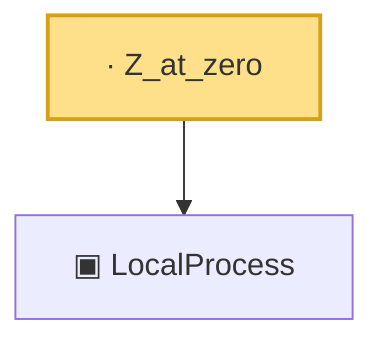

# Proof narrative — Z_at_zero

Root: **Z_at_zero** (lemma) `Statlib/CoxChangePoint/Theorem3Proof.lean:89` · topic `CoxChangePoint`
Closure: 2 declarations across 1 files. Generated from `proof_graph.json` — no files were moved.

Reading order (foundations first, headline last):

  ▣ `LocalProcess` — structure · `Statlib/CoxChangePoint/Theorem3Proof.lean:72`  _(also used by 3: CoxTheorem3Hypotheses, CoxModel.toCoxTheorem3Hypotheses, cox_theorem_3_end_to_end)_
· `Z_at_zero` — lemma · `Statlib/CoxChangePoint/Theorem3Proof.lean:89` **← headline**

## Dependency diagram

