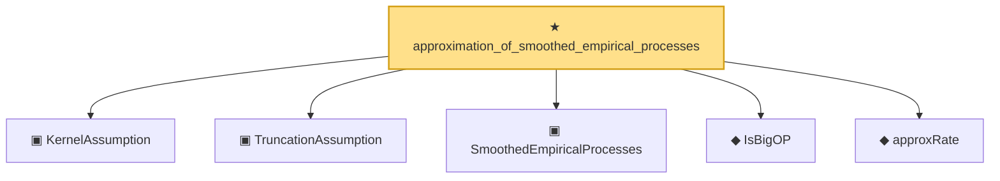

# Proof narrative — approximation_of_smoothed_empirical_processes

Root: **approximation_of_smoothed_empirical_processes** (theorem) `Statlib/CoxChangePoint/Auto/approximation_of_smoothed_empirical_processes.lean:87` · topic `CoxChangePoint`
Closure: 6 declarations across 1 files. Generated from `proof_graph.json` — no files were moved.

Reading order (foundations first, headline last):

  ▣ `KernelAssumption` — private structure · `Statlib/CoxChangePoint/Auto/approximation_of_smoothed_empirical_processes.lean:28`
  ▣ `TruncationAssumption` — private structure · `Statlib/CoxChangePoint/Auto/approximation_of_smoothed_empirical_processes.lean:37`
  ▣ `SmoothedEmpiricalProcesses` — private structure · `Statlib/CoxChangePoint/Auto/approximation_of_smoothed_empirical_processes.lean:55`
  ◆ `IsBigOP` — private def · `Statlib/CoxChangePoint/Auto/approximation_of_smoothed_empirical_processes.lean:22`
  ◆ `approxRate` — private def · `Statlib/CoxChangePoint/Auto/approximation_of_smoothed_empirical_processes.lean:44`
★ `approximation_of_smoothed_empirical_processes` — theorem · `Statlib/CoxChangePoint/Auto/approximation_of_smoothed_empirical_processes.lean:87` **← headline**

## Dependency diagram

