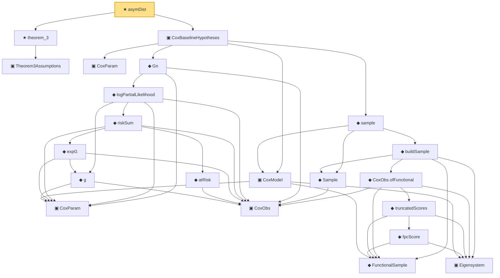

# Proof narrative — asymDist

Root: **asymDist** (theorem) `Statlib/CoxChangePoint/CoxConsistencyEndToEnd.lean:173` · topic `CoxChangePoint`
Closure: 22 declarations across 6 files. Generated from `proof_graph.json` — no files were moved.

Reading order (foundations first, headline last):

    ▣ `Theorem3Assumptions` — structure · `Statlib/CoxChangePoint/Theorem2And3.lean:119`  _(also used by 1: jointAsymptoticDistToTheorem3)_
  ★ `theorem_3` — theorem · `Statlib/CoxChangePoint/Theorem2And3.lean:165`  _(also used by 1: toAsymDist)_
      ▣ `CoxParam` — structure · `Statlib/CoxChangePoint/Foundation.lean:57`  _(also used by 68: liftAuto, concreteGn, buildLemmaS1Data, …)_
      ◆ `FunctionalSample` — def · `Statlib/CoxChangePoint/FPC.lean:55`  _(also used by 10: truncationResidual, empiricalCovariance, fpcScoreError, …)_
      ▣ `Eigensystem` — structure · `Statlib/CoxChangePoint/FPC.lean:42`  _(also used by 18: benchmark_eigsys, truncationResidual, EstimatedEigensystem, …)_
    ▣ `CoxModel` — structure · `Statlib/CoxChangePoint/CoxModel.lean:80`  _(also used by 11: benchmark_model, CoxBaselineHypotheses.hWellSep_from_concave, CoxBaselineHypotheses.hArgmax_from_MLE, …)_
    ▣ `CoxParam` — private structure · `Statlib/CoxChangePoint/Auto/smoothed_empirical_process_approximation.lean:18`  _(also used by 12: AssumptionsA8A9, smoothed_empirical_process_approximation_S1, smoothed_empirical_process_approximation_S2, …)_
      ▣ `CoxObs` — structure · `Statlib/CoxChangePoint/Foundation.lean:38`  _(also used by 35: TruncSample, benchmark_obs, coxScoreAt, …)_
        ◆ `g` — noncomputable def · `Statlib/CoxChangePoint/Foundation.lean:68`  _(also used by 17: AssumptionA7, exponential_moment_bound, HasFirstOrderTaylor, …)_
          ◆ `atRisk` — noncomputable def · `Statlib/CoxChangePoint/Foundation.lean:89`  _(also used by 3: riskSumWeightedZ, riskSumWeightedAlpha, riskSumWeightedBeta)_
          ◆ `expG` — noncomputable def · `Statlib/CoxChangePoint/Foundation.lean:75`  _(also used by 4: expG_pos, riskSumWeightedZ, riskSumWeightedAlpha, …)_
        ◆ `riskSum` — noncomputable def · `Statlib/CoxChangePoint/Foundation.lean:93`  _(also used by 4: riskSum_nonneg, meanZ, meanAlphaInRiskSet, …)_
      ◆ `logPartialLikelihood` — noncomputable def · `Statlib/CoxChangePoint/Foundation.lean:104`  _(also used by 6: coxLogPartialLikelihoodRatio, CoxFirstOrderTaylor, IsLikelihoodArgmax, …)_
    ◆ `Gn` — noncomputable def · `Statlib/CoxChangePoint/Foundation.lean:112`  _(also used by 18: LemmaS1Data, concreteGn, buildLemmaS1Data, …)_
      ◆ `Sample` — def · `Statlib/CoxChangePoint/Foundation.lean:127`  _(also used by 22: benchmark_sample, CoxLANExpansionHypothesis, coxLogRatio, …)_
            ◆ `fpcScore` — noncomputable def · `Statlib/CoxChangePoint/FPC.lean:64`  _(also used by 2: truncationResidual, fpcScoreError)_
          ◆ `truncatedScores` — noncomputable def · `Statlib/CoxChangePoint/FPC.lean:69`
        ◆ `CoxObs.ofFunctional` — noncomputable def · `Statlib/CoxChangePoint/FPC.lean:110`
      ◆ `buildSample` — noncomputable def · `Statlib/CoxChangePoint/FPC.lean:158`
    ◆ `sample` — def · `Statlib/CoxChangePoint/CoxModel.lean:132`  _(also used by 5: CoxBaselineHypotheses.hArgmax_from_MLE, CoxBaselineHypotheses.hUnif_from_VW_2_14_9, cox_consistency_end_to_end, …)_
  ▣ `CoxBaselineHypotheses` — structure · `Statlib/CoxChangePoint/CoxConsistencyEndToEnd.lean:93`  _(also used by 2: consistency, rate)_
★ `asymDist` — theorem · `Statlib/CoxChangePoint/CoxConsistencyEndToEnd.lean:173` **← headline**

## Dependency diagram

