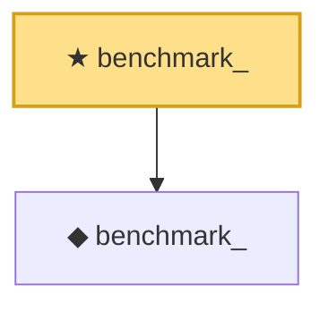

# Proof narrative — benchmark_

Root: **benchmark_** (theorem) `Statlib/CoxChangePoint/CoxBenchmarkInstance.lean:151` · topic `CoxChangePoint`
Closure: 2 declarations across 1 files. Generated from `proof_graph.json` — no files were moved.

Reading order (foundations first, headline last):

  ◆ `benchmark_` — def · `Statlib/CoxChangePoint/CoxBenchmarkInstance.lean:55`  _(also used by 5: benchmark_, benchmark_sample, benchmark_model, …)_
★ `benchmark_` — theorem · `Statlib/CoxChangePoint/CoxBenchmarkInstance.lean:151` **← headline**

## Dependency diagram

