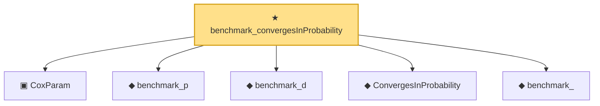

# Proof narrative — benchmark_convergesInProbability

Root: **benchmark_convergesInProbability** (theorem) `Statlib/CoxChangePoint/CoxBenchmarkInstance.lean:198` · topic `CoxChangePoint`
Closure: 6 declarations across 3 files. Generated from `proof_graph.json` — no files were moved.

Reading order (foundations first, headline last):

  ▣ `CoxParam` — structure · `Statlib/CoxChangePoint/Foundation.lean:57`  _(also used by 72: liftAuto, concreteGn, buildLemmaS1Data, …)_
  ◆ `benchmark_p` — def · `Statlib/CoxChangePoint/CoxBenchmarkInstance.lean:47`  _(also used by 5: benchmark_, benchmark_obs, benchmark_sample, …)_
  ◆ `benchmark_d` — def · `Statlib/CoxChangePoint/CoxBenchmarkInstance.lean:50`  _(also used by 5: benchmark_, benchmark_obs, benchmark_sample, …)_
  ◆ `ConvergesInProbability` — def · `Statlib/EmpiricalProcess/StochasticOrder.lean:54`  _(also used by 9: consistency, cox_consistency_end_to_end, CoxTheorem2Hypotheses, …)_
  ◆ `benchmark_` — def · `Statlib/CoxChangePoint/CoxBenchmarkInstance.lean:55`  _(also used by 4: benchmark_, benchmark_sample, benchmark_model, …)_
★ `benchmark_convergesInProbability` — theorem · `Statlib/CoxChangePoint/CoxBenchmarkInstance.lean:198` **← headline**

## Dependency diagram

