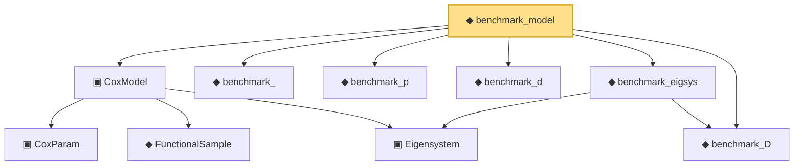

# Proof narrative — benchmark_model

Root: **benchmark_model** (noncomputable def) `Statlib/CoxChangePoint/CoxBenchmarkInstance.lean:125` · topic `CoxChangePoint`
Closure: 10 declarations across 4 files. Generated from `proof_graph.json` — no files were moved.

Reading order (foundations first, headline last):

    ▣ `CoxParam` — structure · `Statlib/CoxChangePoint/Foundation.lean:57`  _(also used by 72: liftAuto, concreteGn, buildLemmaS1Data, …)_
    ◆ `FunctionalSample` — def · `Statlib/CoxChangePoint/FPC.lean:55`  _(also used by 14: fpcScore, truncatedScores, truncationResidual, …)_
    ▣ `Eigensystem` — structure · `Statlib/CoxChangePoint/FPC.lean:42`  _(also used by 21: fpcScore, truncatedScores, truncationResidual, …)_
  ▣ `CoxModel` — structure · `Statlib/CoxChangePoint/CoxModel.lean:80`  _(also used by 12: CoxBaselineHypotheses, CoxBaselineHypotheses.hWellSep_from_concave, CoxBaselineHypotheses.hArgmax_from_MLE, …)_
  ◆ `benchmark_` — def · `Statlib/CoxChangePoint/CoxBenchmarkInstance.lean:55`  _(also used by 4: benchmark_, benchmark_sample, benchmark_consistency_trivially_true, …)_
  ◆ `benchmark_D` — def · `Statlib/CoxChangePoint/CoxBenchmarkInstance.lean:70`  _(also used by 1: benchmark_)_
  ◆ `benchmark_p` — def · `Statlib/CoxChangePoint/CoxBenchmarkInstance.lean:47`  _(also used by 5: benchmark_, benchmark_obs, benchmark_sample, …)_
  ◆ `benchmark_d` — def · `Statlib/CoxChangePoint/CoxBenchmarkInstance.lean:50`  _(also used by 5: benchmark_, benchmark_obs, benchmark_sample, …)_
  ◆ `benchmark_eigsys` — noncomputable def · `Statlib/CoxChangePoint/CoxBenchmarkInstance.lean:113`
◆ `benchmark_model` — noncomputable def · `Statlib/CoxChangePoint/CoxBenchmarkInstance.lean:125` **← headline**

## Dependency diagram

