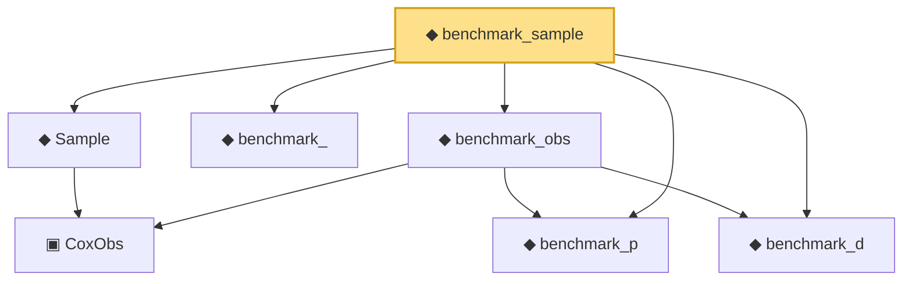

# Proof narrative — benchmark_sample

Root: **benchmark_sample** (def) `Statlib/CoxChangePoint/CoxBenchmarkInstance.lean:104` · topic `CoxChangePoint`
Closure: 7 declarations across 2 files. Generated from `proof_graph.json` — no files were moved.

Reading order (foundations first, headline last):

    ▣ `CoxObs` — structure · `Statlib/CoxChangePoint/Foundation.lean:38`  _(also used by 41: TruncSample, coxScoreAt, coxScoreAt_dim_match, …)_
  ◆ `Sample` — def · `Statlib/CoxChangePoint/Foundation.lean:127`  _(also used by 23: CoxLANExpansionHypothesis, coxLogRatio, sample, …)_
  ◆ `benchmark_` — def · `Statlib/CoxChangePoint/CoxBenchmarkInstance.lean:55`  _(also used by 4: benchmark_, benchmark_model, benchmark_consistency_trivially_true, …)_
  ◆ `benchmark_p` — def · `Statlib/CoxChangePoint/CoxBenchmarkInstance.lean:47`  _(also used by 4: benchmark_, benchmark_model, benchmark_consistency_trivially_true, …)_
  ◆ `benchmark_d` — def · `Statlib/CoxChangePoint/CoxBenchmarkInstance.lean:50`  _(also used by 4: benchmark_, benchmark_model, benchmark_consistency_trivially_true, …)_
  ◆ `benchmark_obs` — def · `Statlib/CoxChangePoint/CoxBenchmarkInstance.lean:93`
◆ `benchmark_sample` — def · `Statlib/CoxChangePoint/CoxBenchmarkInstance.lean:104` **← headline**

## Dependency diagram

