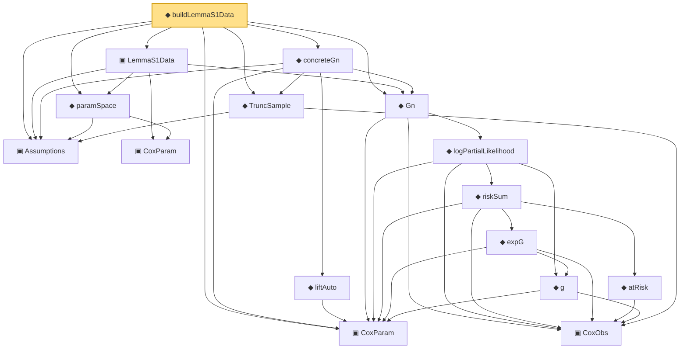

# Proof narrative — buildLemmaS1Data

Root: **buildLemmaS1Data** (noncomputable def) `Statlib/CoxChangePoint/Bridge.lean:54` · topic `CoxChangePoint`
Closure: 16 declarations across 3 files. Generated from `proof_graph.json` — no files were moved.

Reading order (foundations first, headline last):

  ▣ `Assumptions` — structure · `Statlib/CoxChangePoint/Auto/uniform_convergence_of_Gn.lean:37`  _(also used by 1: uniform_convergence_of_Gn)_
    ▣ `CoxObs` — structure · `Statlib/CoxChangePoint/Foundation.lean:38`  _(also used by 36: benchmark_obs, coxScoreAt, coxScoreAt_dim_match, …)_
  ◆ `TruncSample` — def · `Statlib/CoxChangePoint/Bridge.lean:39`
  ▣ `CoxParam` — structure · `Statlib/CoxChangePoint/Foundation.lean:57`  _(also used by 66: benchmark_, benchmark_consistency_trivially_true, benchmark_convergesInProbability, …)_
    ▣ `CoxParam` — structure · `Statlib/CoxChangePoint/Auto/uniform_convergence_of_Gn.lean:29`
  ◆ `paramSpace` — def · `Statlib/CoxChangePoint/Auto/uniform_convergence_of_Gn.lean:70`
        ◆ `g` — noncomputable def · `Statlib/CoxChangePoint/Foundation.lean:68`  _(also used by 17: AssumptionA7, exponential_moment_bound, HasFirstOrderTaylor, …)_
          ◆ `atRisk` — noncomputable def · `Statlib/CoxChangePoint/Foundation.lean:89`  _(also used by 3: riskSumWeightedZ, riskSumWeightedAlpha, riskSumWeightedBeta)_
          ◆ `expG` — noncomputable def · `Statlib/CoxChangePoint/Foundation.lean:75`  _(also used by 4: expG_pos, riskSumWeightedZ, riskSumWeightedAlpha, …)_
        ◆ `riskSum` — noncomputable def · `Statlib/CoxChangePoint/Foundation.lean:93`  _(also used by 4: riskSum_nonneg, meanZ, meanAlphaInRiskSet, …)_
      ◆ `logPartialLikelihood` — noncomputable def · `Statlib/CoxChangePoint/Foundation.lean:104`  _(also used by 6: coxLogPartialLikelihoodRatio, CoxFirstOrderTaylor, IsLikelihoodArgmax, …)_
  ◆ `Gn` — noncomputable def · `Statlib/CoxChangePoint/Foundation.lean:112`  _(also used by 16: CoxBaselineHypotheses, CoxBaselineHypotheses.hArgmax_from_MLE, CoxBaselineHypotheses.hUnif_from_VW_2_14_9, …)_
    ◆ `liftAuto` — def · `Statlib/CoxChangePoint/Bridge.lean:30`
  ◆ `concreteGn` — noncomputable def · `Statlib/CoxChangePoint/Bridge.lean:44`
  ▣ `LemmaS1Data` — structure · `Statlib/CoxChangePoint/Auto/uniform_convergence_of_Gn.lean:84`  _(also used by 1: uniform_convergence_of_Gn)_
◆ `buildLemmaS1Data` — noncomputable def · `Statlib/CoxChangePoint/Bridge.lean:54` **← headline**

## Dependency diagram

