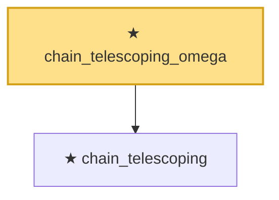

# Proof narrative — chain_telescoping_omega

Root: **chain_telescoping_omega** (theorem) `Statlib/CoxChangePoint/ChainingRecursion.lean:213` · topic `CoxChangePoint`
Closure: 2 declarations across 1 files. Generated from `proof_graph.json` — no files were moved.

Reading order (foundations first, headline last):

  ★ `chain_telescoping` — theorem · `Statlib/CoxChangePoint/ChainingRecursion.lean:195`
★ `chain_telescoping_omega` — theorem · `Statlib/CoxChangePoint/ChainingRecursion.lean:213` **← headline**

## Dependency diagram

