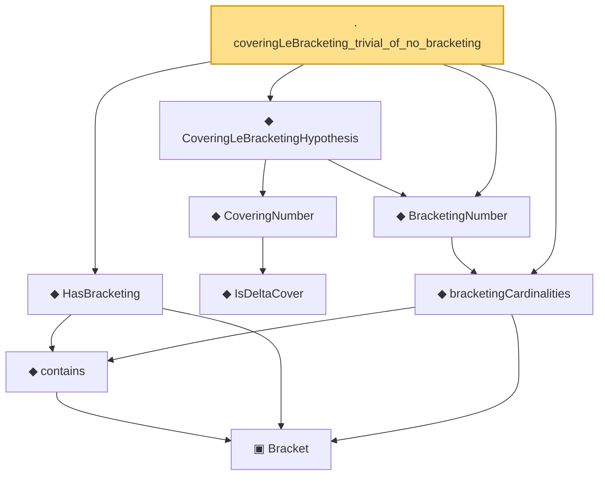

# Proof narrative — coveringLeBracketing_trivial_of_no_bracketing

Root: **coveringLeBracketing_trivial_of_no_bracketing** (lemma) `Statlib/CoxChangePoint/ChainingProof.lean:104` · topic `CoxChangePoint`
Closure: 9 declarations across 3 files. Generated from `proof_graph.json` — no files were moved.

Reading order (foundations first, headline last):

    ▣ `Bracket` — structure · `Statlib/CoxChangePoint/BracketingEntropy.lean:58`  _(also used by 2: lower_le_of_contains, le_upper_of_contains)_
    ◆ `contains` — def · `Statlib/CoxChangePoint/BracketingEntropy.lean:79`  _(also used by 2: lower_le_of_contains, le_upper_of_contains)_
  ◆ `HasBracketing` — def · `Statlib/CoxChangePoint/BracketingEntropy.lean:102`  _(also used by 2: BracketingNumber_lt_top_of_hasBracketing, hasBracketing_of_bracketingNumber_lt_top)_
      ◆ `IsDeltaCover` — def · `Statlib/CoxChangePoint/Chaining.lean:61`  _(also used by 1: isDeltaCover_zero_iff)_
    ◆ `CoveringNumber` — noncomputable def · `Statlib/CoxChangePoint/Chaining.lean:70`  _(also used by 3: coveringNumber_empty, DudleyCoveringPackingBound, DudleyEntropyBound)_
  ◆ `bracketingCardinalities` — def · `Statlib/CoxChangePoint/BracketingEntropy.lean:111`  _(also used by 2: BracketingNumber_lt_top_of_hasBracketing, hasBracketing_of_bracketingNumber_lt_top)_
  ◆ `BracketingNumber` — noncomputable def · `Statlib/CoxChangePoint/BracketingEntropy.lean:120`  _(also used by 5: BracketingNumber_lt_top_of_hasBracketing, hasBracketing_of_bracketingNumber_lt_top, bracketingEntropy, …)_
  ◆ `CoveringLeBracketingHypothesis` — def · `Statlib/CoxChangePoint/ChainingProof.lean:93`
· `coveringLeBracketing_trivial_of_no_bracketing` — lemma · `Statlib/CoxChangePoint/ChainingProof.lean:104` **← headline**

## Dependency diagram

