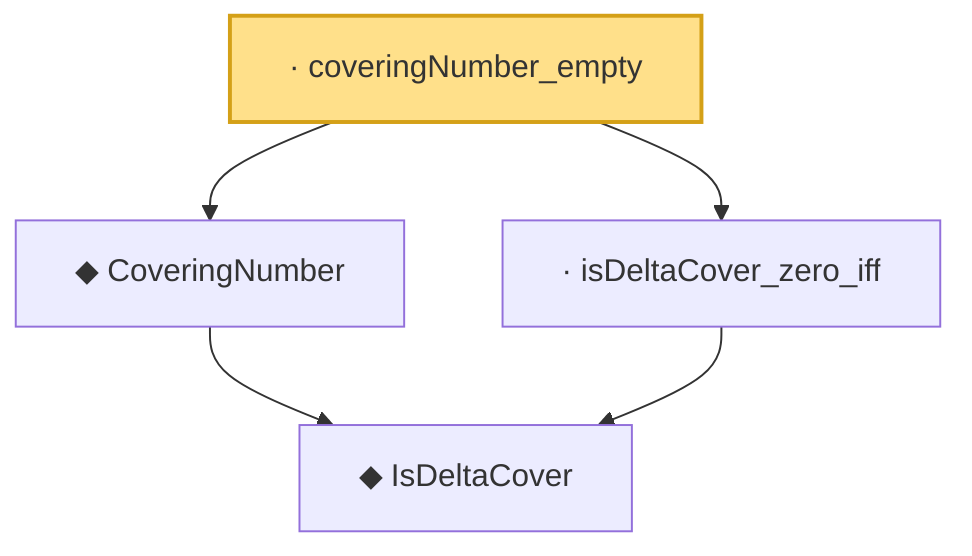

# Proof narrative — coveringNumber_empty

Root: **coveringNumber_empty** (lemma) `Statlib/CoxChangePoint/Chaining.lean:91` · topic `CoxChangePoint`
Closure: 4 declarations across 1 files. Generated from `proof_graph.json` — no files were moved.

Reading order (foundations first, headline last):

    ◆ `IsDeltaCover` — def · `Statlib/CoxChangePoint/Chaining.lean:61`
  ◆ `CoveringNumber` — noncomputable def · `Statlib/CoxChangePoint/Chaining.lean:70`  _(also used by 3: DudleyCoveringPackingBound, DudleyEntropyBound, CoveringLeBracketingHypothesis)_
  · `isDeltaCover_zero_iff` — lemma · `Statlib/CoxChangePoint/Chaining.lean:75`
· `coveringNumber_empty` — lemma · `Statlib/CoxChangePoint/Chaining.lean:91` **← headline**

## Dependency diagram

