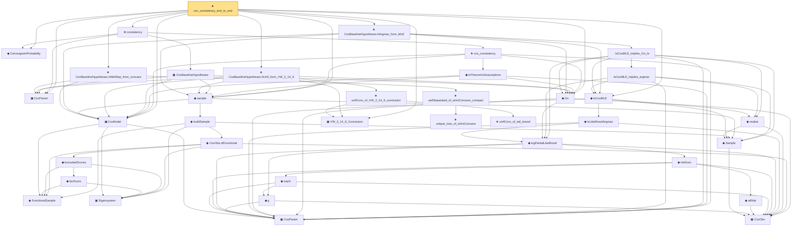

# Proof narrative — cox_consistency_end_to_end

Root: **cox_consistency_end_to_end** (theorem) `Statlib/CoxChangePoint/CoxConsistencyEndToEnd.lean:365` · topic `CoxChangePoint`
Closure: 37 declarations across 10 files. Generated from `proof_graph.json` — no files were moved.

Reading order (foundations first, headline last):

    ▣ `CoxParam` — structure · `Statlib/CoxChangePoint/Foundation.lean:57`  _(also used by 62: liftAuto, concreteGn, buildLemmaS1Data, …)_
    ◆ `FunctionalSample` — def · `Statlib/CoxChangePoint/FPC.lean:55`  _(also used by 10: truncationResidual, empiricalCovariance, fpcScoreError, …)_
    ▣ `Eigensystem` — structure · `Statlib/CoxChangePoint/FPC.lean:42`  _(also used by 18: benchmark_eigsys, truncationResidual, EstimatedEigensystem, …)_
  ▣ `CoxModel` — structure · `Statlib/CoxChangePoint/CoxModel.lean:80`  _(also used by 5: benchmark_model, CoxModel.toCoxTheorem2Hypotheses, CoxModel.toCoxTheorem3Hypotheses, …)_
  ▣ `CoxParam` — private structure · `Statlib/CoxChangePoint/Auto/smoothed_empirical_process_approximation.lean:18`  _(also used by 8: AssumptionsA8A9, smoothed_empirical_process_approximation_S1, smoothed_empirical_process_approximation_S2, …)_
    ▣ `CoxObs` — structure · `Statlib/CoxChangePoint/Foundation.lean:38`  _(also used by 33: TruncSample, benchmark_obs, coxScoreAt, …)_
    ◆ `Sample` — def · `Statlib/CoxChangePoint/Foundation.lean:127`  _(also used by 18: benchmark_sample, CoxLANExpansionHypothesis, coxLogRatio, …)_
        ◆ `g` — noncomputable def · `Statlib/CoxChangePoint/Foundation.lean:68`  _(also used by 17: AssumptionA7, exponential_moment_bound, HasFirstOrderTaylor, …)_
          ◆ `atRisk` — noncomputable def · `Statlib/CoxChangePoint/Foundation.lean:89`  _(also used by 3: riskSumWeightedZ, riskSumWeightedAlpha, riskSumWeightedBeta)_
          ◆ `expG` — noncomputable def · `Statlib/CoxChangePoint/Foundation.lean:75`  _(also used by 4: expG_pos, riskSumWeightedZ, riskSumWeightedAlpha, …)_
        ◆ `riskSum` — noncomputable def · `Statlib/CoxChangePoint/Foundation.lean:93`  _(also used by 4: riskSum_nonneg, meanZ, meanAlphaInRiskSet, …)_
    ◆ `logPartialLikelihood` — noncomputable def · `Statlib/CoxChangePoint/Foundation.lean:104`  _(also used by 3: coxLogPartialLikelihoodRatio, CoxFirstOrderTaylor, IsLikelihoodArgmax.le)_
    ◆ `IsLikelihoodArgmax` — def · `Statlib/CoxChangePoint/ScoreEquation.lean:70`  _(also used by 3: IsLikelihoodArgmax.mem, IsLikelihoodArgmax.le, IsCoxMLE.argmax)_
    ◆ `realize` — def · `Statlib/CoxChangePoint/Foundation.lean:135`  _(also used by 9: CoxLANExpansionHypothesis, coxLogRatio, toLANExpansion, …)_
  ◆ `IsCoxMLE` — def · `Statlib/CoxChangePoint/ScoreEquation.lean:90`  _(also used by 1: IsCoxMLE.argmax)_
          ◆ `fpcScore` — noncomputable def · `Statlib/CoxChangePoint/FPC.lean:64`  _(also used by 2: truncationResidual, fpcScoreError)_
        ◆ `truncatedScores` — noncomputable def · `Statlib/CoxChangePoint/FPC.lean:69`
      ◆ `CoxObs.ofFunctional` — noncomputable def · `Statlib/CoxChangePoint/FPC.lean:110`
    ◆ `buildSample` — noncomputable def · `Statlib/CoxChangePoint/FPC.lean:158`
  ◆ `sample` — def · `Statlib/CoxChangePoint/CoxModel.lean:132`
  ▣ `VW_2_14_9_Conclusion` — structure · `Statlib/CoxChangePoint/ChainingProof.lean:226`  _(also used by 6: VW_2_14_9_Conclusion.tail_bound_no_sqrt, toConclusion, PolynomialBracketingClass.toVW_2_14_9_Conclusion, …)_
  ◆ `Gn` — noncomputable def · `Statlib/CoxChangePoint/Foundation.lean:112`  _(also used by 12: LemmaS1Data, concreteGn, buildLemmaS1Data, …)_
  ◆ `ConvergesInProbability` — def · `Statlib/EmpiricalProcess/StochasticOrder.lean:54`  _(also used by 8: benchmark_convergesInProbability, CoxTheorem2Hypotheses, CoxModel.toCoxTheorem2Hypotheses, …)_
      ★ `unique_max_of_strictConcave` — theorem · `Statlib/CoxChangePoint/StrictConcaveUnique.lean:52`
    ★ `wellSeparated_of_strictConcave_compact` — theorem · `Statlib/CoxChangePoint/StrictConcaveUnique.lean:96`
  ★ `CoxBaselineHypotheses.hWellSep_from_concave` — theorem · `Statlib/CoxChangePoint/CoxConsistencyEndToEnd.lean:230`
      · `IsCoxMLE_implies_argmax` — lemma · `Statlib/CoxChangePoint/ScoreEquation.lean:105`
    · `IsCoxMLE_implies_Gn_le` — lemma · `Statlib/CoxChangePoint/ScoreEquation.lean:119`
  ★ `CoxBaselineHypotheses.hArgmax_from_MLE` — theorem · `Statlib/CoxChangePoint/CoxConsistencyEndToEnd.lean:266`
      ★ `unifConv_of_tail_bound` — theorem · `Statlib/CoxChangePoint/LemmaS1Abstract.lean:77`  _(also used by 1: unifConv_of_two_param_tail_bound)_
    ★ `unifConv_of_VW_2_14_9_conclusion` — theorem · `Statlib/CoxChangePoint/ChainingProof.lean:296`  _(also used by 1: PolynomialBracketingClass.unifConv)_
  ★ `CoxBaselineHypotheses.hUnif_from_VW_2_14_9` — theorem · `Statlib/CoxChangePoint/CoxConsistencyEndToEnd.lean:291`
    ▣ `CoxBaselineHypotheses` — structure · `Statlib/CoxChangePoint/CoxConsistencyEndToEnd.lean:93`  _(also used by 2: rate, asymDist)_
      ◆ `toTheorem1Assumptions` — def · `Statlib/CoxChangePoint/CoxModel.lean:168`
    ★ `cox_consistency` — theorem · `Statlib/CoxChangePoint/CoxModel.lean:213`
  ★ `consistency` — theorem · `Statlib/CoxChangePoint/CoxConsistencyEndToEnd.lean:125`  _(also used by 1: rate)_
★ `cox_consistency_end_to_end` — theorem · `Statlib/CoxChangePoint/CoxConsistencyEndToEnd.lean:365` **← headline**

## Dependency diagram

