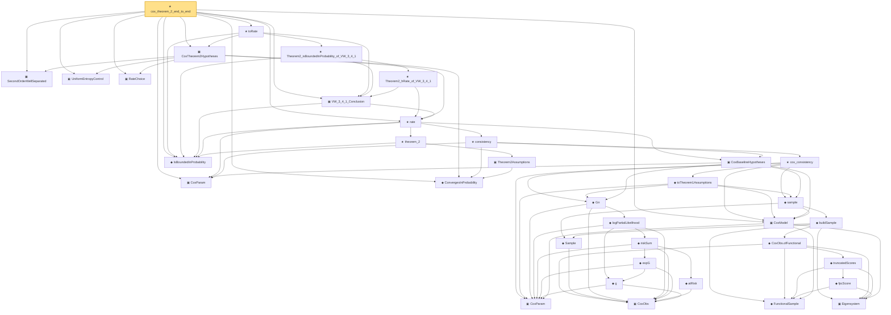

# Proof narrative — cox_theorem_2_end_to_end

Root: **cox_theorem_2_end_to_end** (theorem) `Statlib/CoxChangePoint/CoxTheorem23EndToEnd.lean:351` · topic `CoxChangePoint`
Closure: 36 declarations across 9 files. Generated from `proof_graph.json` — no files were moved.

Reading order (foundations first, headline last):

    ▣ `CoxParam` — structure · `Statlib/CoxChangePoint/Foundation.lean:57`  _(also used by 66: liftAuto, concreteGn, buildLemmaS1Data, …)_
    ◆ `FunctionalSample` — def · `Statlib/CoxChangePoint/FPC.lean:55`  _(also used by 10: truncationResidual, empiricalCovariance, fpcScoreError, …)_
    ▣ `Eigensystem` — structure · `Statlib/CoxChangePoint/FPC.lean:42`  _(also used by 18: benchmark_eigsys, truncationResidual, EstimatedEigensystem, …)_
  ▣ `CoxModel` — structure · `Statlib/CoxChangePoint/CoxModel.lean:80`  _(also used by 8: benchmark_model, CoxBaselineHypotheses.hWellSep_from_concave, CoxBaselineHypotheses.hArgmax_from_MLE, …)_
  ▣ `CoxParam` — private structure · `Statlib/CoxChangePoint/Auto/smoothed_empirical_process_approximation.lean:18`  _(also used by 9: AssumptionsA8A9, smoothed_empirical_process_approximation_S1, smoothed_empirical_process_approximation_S2, …)_
  ◆ `ConvergesInProbability` — def · `Statlib/EmpiricalProcess/StochasticOrder.lean:54`  _(also used by 6: benchmark_convergesInProbability, cox_consistency_end_to_end, CoxModel.toCoxTheorem2Hypotheses, …)_
  ▣ `SecondOrderWellSeparated` — structure · `Statlib/CoxChangePoint/Theorem2Proof.lean:80`  _(also used by 1: CoxModel.toCoxTheorem2Hypotheses)_
  ▣ `UniformEntropyControl` — structure · `Statlib/CoxChangePoint/Theorem2Proof.lean:98`  _(also used by 1: CoxModel.toCoxTheorem2Hypotheses)_
        ▣ `CoxObs` — structure · `Statlib/CoxChangePoint/Foundation.lean:38`  _(also used by 35: TruncSample, benchmark_obs, coxScoreAt, …)_
          ◆ `g` — noncomputable def · `Statlib/CoxChangePoint/Foundation.lean:68`  _(also used by 17: AssumptionA7, exponential_moment_bound, HasFirstOrderTaylor, …)_
            ◆ `atRisk` — noncomputable def · `Statlib/CoxChangePoint/Foundation.lean:89`  _(also used by 3: riskSumWeightedZ, riskSumWeightedAlpha, riskSumWeightedBeta)_
            ◆ `expG` — noncomputable def · `Statlib/CoxChangePoint/Foundation.lean:75`  _(also used by 4: expG_pos, riskSumWeightedZ, riskSumWeightedAlpha, …)_
          ◆ `riskSum` — noncomputable def · `Statlib/CoxChangePoint/Foundation.lean:93`  _(also used by 4: riskSum_nonneg, meanZ, meanAlphaInRiskSet, …)_
        ◆ `logPartialLikelihood` — noncomputable def · `Statlib/CoxChangePoint/Foundation.lean:104`  _(also used by 6: coxLogPartialLikelihoodRatio, CoxFirstOrderTaylor, IsLikelihoodArgmax, …)_
      ◆ `Gn` — noncomputable def · `Statlib/CoxChangePoint/Foundation.lean:112`  _(also used by 16: LemmaS1Data, concreteGn, buildLemmaS1Data, …)_
        ◆ `Sample` — def · `Statlib/CoxChangePoint/Foundation.lean:127`  _(also used by 22: benchmark_sample, CoxLANExpansionHypothesis, coxLogRatio, …)_
            ◆ `fpcScore` — noncomputable def · `Statlib/CoxChangePoint/FPC.lean:64`  _(also used by 2: truncationResidual, fpcScoreError)_
            ◆ `truncatedScores` — noncomputable def · `Statlib/CoxChangePoint/FPC.lean:69`
          ◆ `CoxObs.ofFunctional` — noncomputable def · `Statlib/CoxChangePoint/FPC.lean:110`
        ◆ `buildSample` — noncomputable def · `Statlib/CoxChangePoint/FPC.lean:158`
      ◆ `sample` — def · `Statlib/CoxChangePoint/CoxModel.lean:132`  _(also used by 3: CoxBaselineHypotheses.hArgmax_from_MLE, CoxBaselineHypotheses.hUnif_from_VW_2_14_9, cox_consistency_end_to_end)_
    ▣ `CoxBaselineHypotheses` — structure · `Statlib/CoxChangePoint/CoxConsistencyEndToEnd.lean:93`  _(also used by 1: asymDist)_
  ◆ `IsBoundedInProbability` — def · `Statlib/EmpiricalProcess/StochasticOrder.lean:42`  _(also used by 15: isOP_of_triangle_decomp, LemmaS6Hypotheses, LemmaS6Hypotheses.D_isOP, …)_
      ▣ `Theorem2Assumptions` — structure · `Statlib/CoxChangePoint/Theorem2And3.lean:65`
    ★ `theorem_2` — theorem · `Statlib/CoxChangePoint/Theorem2And3.lean:103`
        ◆ `toTheorem1Assumptions` — def · `Statlib/CoxChangePoint/CoxModel.lean:168`
      ★ `cox_consistency` — theorem · `Statlib/CoxChangePoint/CoxModel.lean:213`
    ★ `consistency` — theorem · `Statlib/CoxChangePoint/CoxConsistencyEndToEnd.lean:125`  _(also used by 1: cox_consistency_end_to_end)_
  ★ `rate` — theorem · `Statlib/CoxChangePoint/CoxConsistencyEndToEnd.lean:138`  _(also used by 2: ConvergesInProbTo, CoxModel.toCoxTheorem2Hypotheses)_
  ▣ `RateChoice` — structure · `Statlib/CoxChangePoint/Theorem2Proof.lean:122`  _(also used by 1: CoxModel.toCoxTheorem2Hypotheses)_
  ▣ `VW_3_4_1_Conclusion` — structure · `Statlib/CoxChangePoint/Theorem2Proof.lean:142`
  ▣ `CoxTheorem2Hypotheses` — structure · `Statlib/CoxChangePoint/CoxTheorem23EndToEnd.lean:94`  _(also used by 1: CoxModel.toCoxTheorem2Hypotheses)_
      ★ `Theorem2_hRate_of_VW_3_4_1` — theorem · `Statlib/CoxChangePoint/Theorem2Proof.lean:169`
    ★ `Theorem2_isBoundedInProbability_of_VW_3_4_1` — theorem · `Statlib/CoxChangePoint/Theorem2Proof.lean:236`
  ★ `toRate` — theorem · `Statlib/CoxChangePoint/CoxTheorem23EndToEnd.lean:140`
★ `cox_theorem_2_end_to_end` — theorem · `Statlib/CoxChangePoint/CoxTheorem23EndToEnd.lean:351` **← headline**

## Dependency diagram

