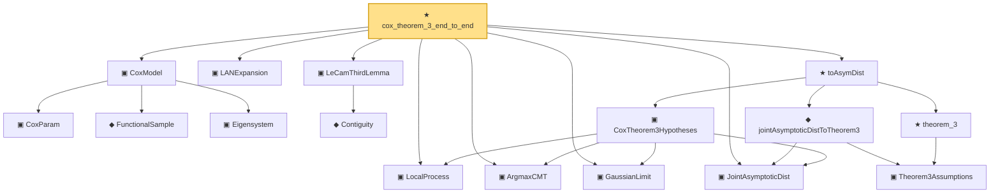

# Proof narrative — cox_theorem_3_end_to_end

Root: **cox_theorem_3_end_to_end** (theorem) `Statlib/CoxChangePoint/CoxTheorem23EndToEnd.lean:387` · topic `CoxChangePoint`
Closure: 17 declarations across 8 files. Generated from `proof_graph.json` — no files were moved.

Reading order (foundations first, headline last):

    ▣ `CoxParam` — structure · `Statlib/CoxChangePoint/Foundation.lean:57`  _(also used by 72: liftAuto, concreteGn, buildLemmaS1Data, …)_
    ◆ `FunctionalSample` — def · `Statlib/CoxChangePoint/FPC.lean:55`  _(also used by 14: fpcScore, truncatedScores, truncationResidual, …)_
    ▣ `Eigensystem` — structure · `Statlib/CoxChangePoint/FPC.lean:42`  _(also used by 22: benchmark_eigsys, fpcScore, truncatedScores, …)_
  ▣ `CoxModel` — structure · `Statlib/CoxChangePoint/CoxModel.lean:80`  _(also used by 12: benchmark_model, CoxBaselineHypotheses, CoxBaselineHypotheses.hWellSep_from_concave, …)_
  ▣ `LANExpansion` — structure · `Statlib/Mathlib/Statistics/LAN.lean:152`  _(also used by 9: toLANExpansion, CoxModel.toCoxTheorem3Hypotheses, expansion_zero, …)_
    ◆ `Contiguity` — def · `Statlib/Mathlib/Statistics/LeCamThirdLemma.lean:86`  _(also used by 8: LANToLeCamBundle, fromCoxScoreSample, identityCov, …)_
  ▣ `LeCamThirdLemma` — structure · `Statlib/Mathlib/Statistics/LeCamThirdLemma.lean:160`  _(also used by 5: CoxModel.toCoxTheorem3Hypotheses, toLeCamThirdLemma, toHajekLeCamViaThird, …)_
  ▣ `LocalProcess` — structure · `Statlib/CoxChangePoint/Theorem3Proof.lean:72`  _(also used by 2: CoxModel.toCoxTheorem3Hypotheses, Z_at_zero)_
  ▣ `ArgmaxCMT` — structure · `Statlib/CoxChangePoint/Theorem3Proof.lean:111`  _(also used by 1: CoxModel.toCoxTheorem3Hypotheses)_
  ▣ `GaussianLimit` — structure · `Statlib/CoxChangePoint/Theorem3Proof.lean:130`  _(also used by 1: CoxModel.toCoxTheorem3Hypotheses)_
  ▣ `JointAsymptoticDist` — structure · `Statlib/CoxChangePoint/Theorem3Proof.lean:149`  _(also used by 1: CoxModel.toCoxTheorem3Hypotheses)_
    ▣ `CoxTheorem3Hypotheses` — structure · `Statlib/CoxChangePoint/CoxTheorem23EndToEnd.lean:170`  _(also used by 1: CoxModel.toCoxTheorem3Hypotheses)_
      ▣ `Theorem3Assumptions` — structure · `Statlib/CoxChangePoint/Theorem2And3.lean:119`
    ★ `theorem_3` — theorem · `Statlib/CoxChangePoint/Theorem2And3.lean:165`  _(also used by 1: asymDist)_
    ◆ `jointAsymptoticDistToTheorem3` — def · `Statlib/CoxChangePoint/Theorem3Proof.lean:183`
  ★ `toAsymDist` — theorem · `Statlib/CoxChangePoint/CoxTheorem23EndToEnd.lean:217`
★ `cox_theorem_3_end_to_end` — theorem · `Statlib/CoxChangePoint/CoxTheorem23EndToEnd.lean:387` **← headline**

## Dependency diagram

