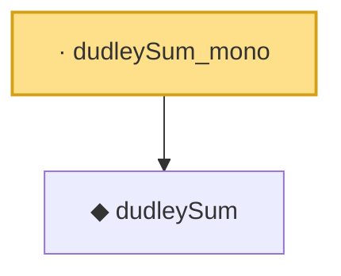

# Proof narrative — dudleySum_mono

Root: **dudleySum_mono** (lemma) `Statlib/CoxChangePoint/ChainingProof.lean:203` · topic `CoxChangePoint`
Closure: 2 declarations across 1 files. Generated from `proof_graph.json` — no files were moved.

Reading order (foundations first, headline last):

  ◆ `dudleySum` — noncomputable def · `Statlib/CoxChangePoint/ChainingProof.lean:188`  _(also used by 1: dudleySum_nonneg)_
· `dudleySum_mono` — lemma · `Statlib/CoxChangePoint/ChainingProof.lean:203` **← headline**

## Dependency diagram

