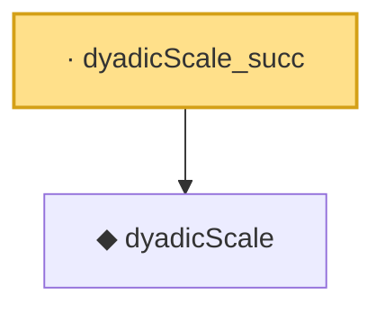

# Proof narrative — dyadicScale_succ

Root: **dyadicScale_succ** (lemma) `Statlib/CoxChangePoint/ChainingRecursion.lean:79` · topic `CoxChangePoint`
Closure: 2 declarations across 1 files. Generated from `proof_graph.json` — no files were moved.

Reading order (foundations first, headline last):

  ◆ `dyadicScale` — noncomputable def · `Statlib/CoxChangePoint/ChainingRecursion.lean:70`  _(also used by 6: dyadicScale_nonneg, dyadicScale_pos, dyadicScale_eq_zpow, …)_
· `dyadicScale_succ` — lemma · `Statlib/CoxChangePoint/ChainingRecursion.lean:79` **← headline**

## Dependency diagram

