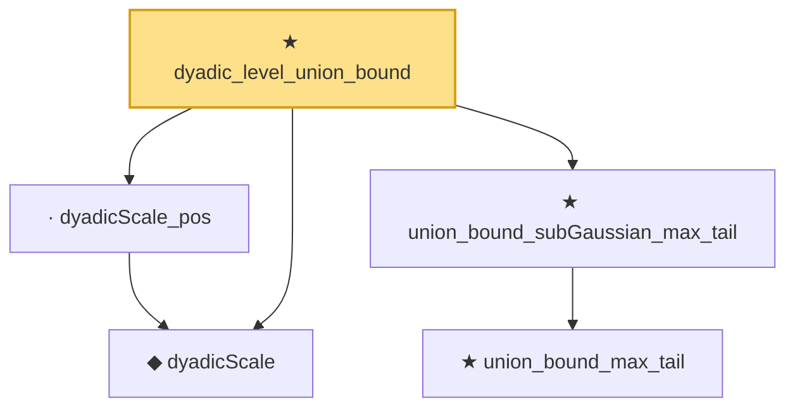

# Proof narrative — dyadic_level_union_bound

Root: **dyadic_level_union_bound** (theorem) `Statlib/CoxChangePoint/ChainingRecursion.lean:229` · topic `CoxChangePoint`
Closure: 5 declarations across 2 files. Generated from `proof_graph.json` — no files were moved.

Reading order (foundations first, headline last):

  ◆ `dyadicScale` — noncomputable def · `Statlib/CoxChangePoint/ChainingRecursion.lean:70`  _(also used by 5: dyadicScale_succ, dyadicScale_nonneg, dyadicScale_eq_zpow, …)_
    ★ `union_bound_max_tail` — theorem · `Statlib/CoxChangePoint/ChainingProof.lean:135`
  ★ `union_bound_subGaussian_max_tail` — theorem · `Statlib/CoxChangePoint/ChainingProof.lean:164`
  · `dyadicScale_pos` — lemma · `Statlib/CoxChangePoint/ChainingRecursion.lean:96`
★ `dyadic_level_union_bound` — theorem · `Statlib/CoxChangePoint/ChainingRecursion.lean:229` **← headline**

## Dependency diagram

