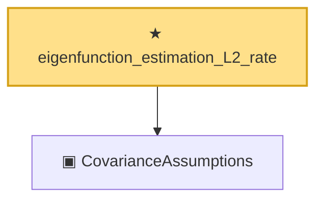

# Proof narrative — eigenfunction_estimation_L2_rate

Root: **eigenfunction_estimation_L2_rate** (theorem) `Statlib/CoxChangePoint/Auto/eigenfunction_estimation_L2_rate.lean:43` · topic `CoxChangePoint`
Closure: 2 declarations across 1 files. Generated from `proof_graph.json` — no files were moved.

Reading order (foundations first, headline last):

  ▣ `CovarianceAssumptions` — private structure · `Statlib/CoxChangePoint/Auto/eigenfunction_estimation_L2_rate.lean:16`
★ `eigenfunction_estimation_L2_rate` — theorem · `Statlib/CoxChangePoint/Auto/eigenfunction_estimation_L2_rate.lean:43` **← headline**

## Dependency diagram

