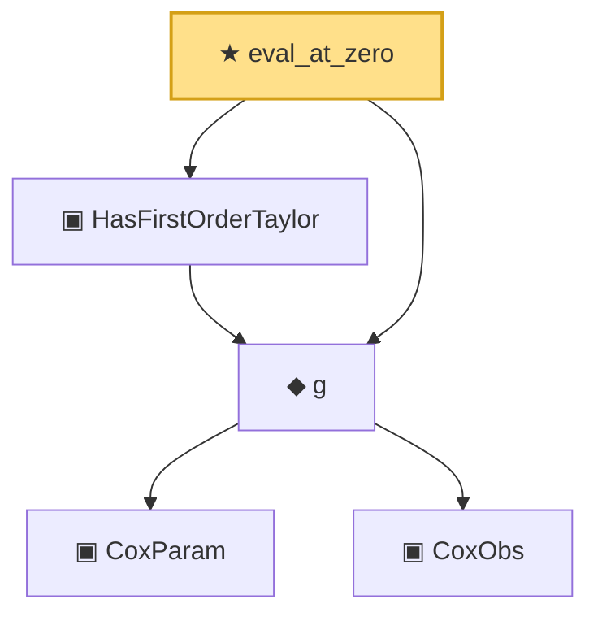

# Proof narrative — eval_at_zero

Root: **eval_at_zero** (theorem) `Statlib/CoxChangePoint/CoxTaylor.lean:118` · topic `CoxChangePoint`
Closure: 5 declarations across 2 files. Generated from `proof_graph.json` — no files were moved.

Reading order (foundations first, headline last):

      ▣ `CoxParam` — structure · `Statlib/CoxChangePoint/Foundation.lean:57`  _(also used by 72: liftAuto, concreteGn, buildLemmaS1Data, …)_
      ▣ `CoxObs` — structure · `Statlib/CoxChangePoint/Foundation.lean:38`  _(also used by 42: TruncSample, benchmark_obs, coxScoreAt, …)_
  ◆ `g` — noncomputable def · `Statlib/CoxChangePoint/Foundation.lean:68`  _(also used by 17: AssumptionA7, exponential_moment_bound, expansion_trivial, …)_
  ▣ `HasFirstOrderTaylor` — structure · `Statlib/CoxChangePoint/CoxTaylor.lean:85`  _(also used by 1: CoxFirstOrderTaylor)_
★ `eval_at_zero` — theorem · `Statlib/CoxChangePoint/CoxTaylor.lean:118` **← headline**

## Dependency diagram

