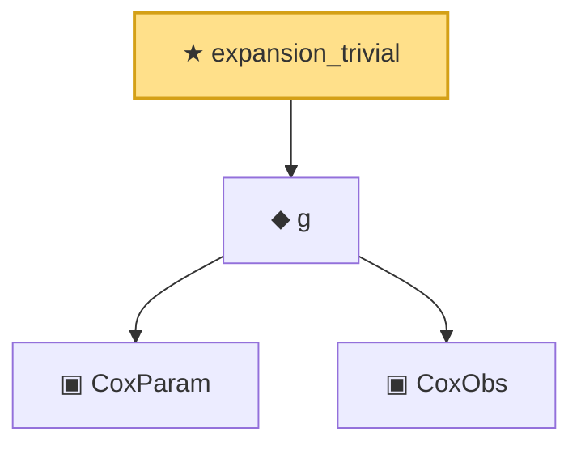

# Proof narrative — expansion_trivial

Root: **expansion_trivial** (theorem) `Statlib/CoxChangePoint/CoxTaylor.lean:110` · topic `CoxChangePoint`
Closure: 4 declarations across 2 files. Generated from `proof_graph.json` — no files were moved.

Reading order (foundations first, headline last):

    ▣ `CoxParam` — structure · `Statlib/CoxChangePoint/Foundation.lean:57`  _(also used by 72: liftAuto, concreteGn, buildLemmaS1Data, …)_
    ▣ `CoxObs` — structure · `Statlib/CoxChangePoint/Foundation.lean:38`  _(also used by 42: TruncSample, benchmark_obs, coxScoreAt, …)_
  ◆ `g` — noncomputable def · `Statlib/CoxChangePoint/Foundation.lean:68`  _(also used by 18: AssumptionA7, exponential_moment_bound, HasFirstOrderTaylor, …)_
★ `expansion_trivial` — theorem · `Statlib/CoxChangePoint/CoxTaylor.lean:110` **← headline**

## Dependency diagram

