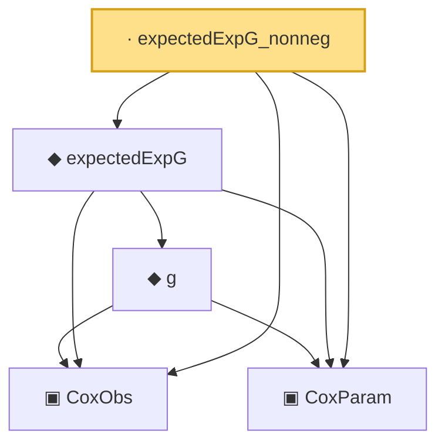

# Proof narrative — expectedExpG_nonneg

Root: **expectedExpG_nonneg** (lemma) `Statlib/CoxChangePoint/PopulationObjectiveConcrete.lean:90` · topic `CoxChangePoint`
Closure: 5 declarations across 2 files. Generated from `proof_graph.json` — no files were moved.

Reading order (foundations first, headline last):

  ▣ `CoxObs` — structure · `Statlib/CoxChangePoint/Foundation.lean:38`  _(also used by 40: TruncSample, benchmark_obs, coxScoreAt, …)_
  ▣ `CoxParam` — structure · `Statlib/CoxChangePoint/Foundation.lean:57`  _(also used by 70: liftAuto, concreteGn, buildLemmaS1Data, …)_
    ◆ `g` — noncomputable def · `Statlib/CoxChangePoint/Foundation.lean:68`  _(also used by 18: AssumptionA7, exponential_moment_bound, HasFirstOrderTaylor, …)_
  ◆ `expectedExpG` — noncomputable def · `Statlib/CoxChangePoint/PopulationObjectiveConcrete.lean:84`  _(also used by 1: populationObjectiveCoxFormula)_
· `expectedExpG_nonneg` — lemma · `Statlib/CoxChangePoint/PopulationObjectiveConcrete.lean:90` **← headline**

## Dependency diagram

