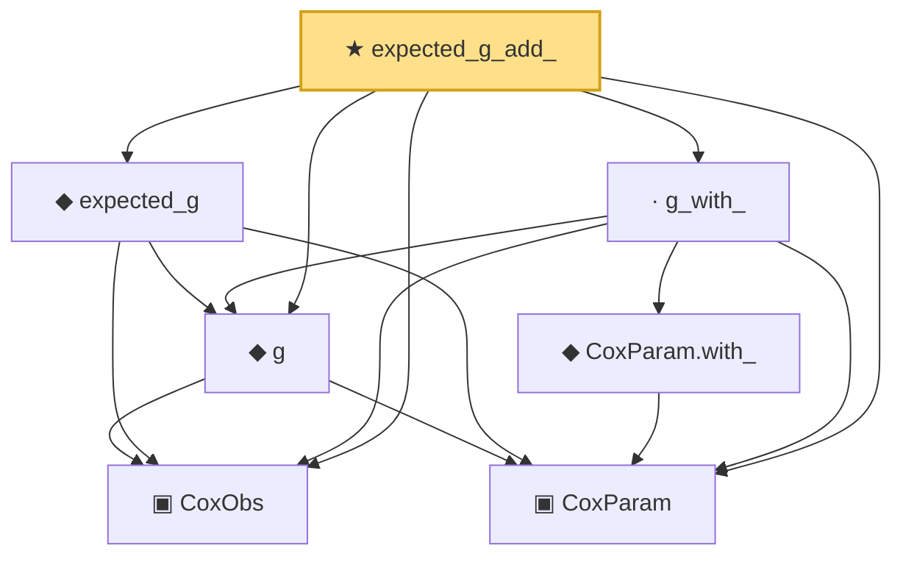

# Proof narrative — expected_g_add_

Root: **expected_g_add_** (theorem) `Statlib/CoxChangePoint/PopulationObjectiveConcrete.lean:148` · topic `CoxChangePoint`
Closure: 7 declarations across 2 files. Generated from `proof_graph.json` — no files were moved.

Reading order (foundations first, headline last):

  ▣ `CoxObs` — structure · `Statlib/CoxChangePoint/Foundation.lean:38`  _(also used by 39: TruncSample, benchmark_obs, coxScoreAt, …)_
  ▣ `CoxParam` — structure · `Statlib/CoxChangePoint/Foundation.lean:57`  _(also used by 68: liftAuto, concreteGn, buildLemmaS1Data, …)_
  ◆ `g` — noncomputable def · `Statlib/CoxChangePoint/Foundation.lean:68`  _(also used by 16: AssumptionA7, exponential_moment_bound, HasFirstOrderTaylor, …)_
  ◆ `expected_g` — noncomputable def · `Statlib/CoxChangePoint/PopulationObjectiveConcrete.lean:78`
    ◆ `CoxParam.with_` — def · `Statlib/CoxChangePoint/PopulationObjectiveConcrete.lean:59`
  · `g_with_` — lemma · `Statlib/CoxChangePoint/PopulationObjectiveConcrete.lean:131`
★ `expected_g_add_` — theorem · `Statlib/CoxChangePoint/PopulationObjectiveConcrete.lean:148` **← headline**

## Dependency diagram

