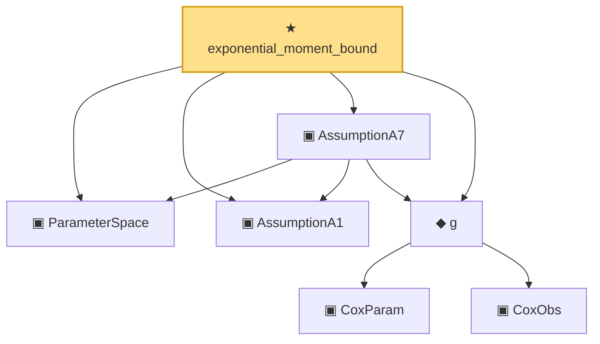

# Proof narrative — exponential_moment_bound

Root: **exponential_moment_bound** (theorem) `Statlib/CoxChangePoint/Auto/exponential_moment_bound.lean:28` · topic `CoxChangePoint`
Closure: 7 declarations across 2 files. Generated from `proof_graph.json` — no files were moved.

Reading order (foundations first, headline last):

  ▣ `ParameterSpace` — private structure · `Statlib/CoxChangePoint/Auto/exponential_moment_bound.lean:6`
  ▣ `AssumptionA1` — private structure · `Statlib/CoxChangePoint/Auto/exponential_moment_bound.lean:9`
      ▣ `CoxParam` — structure · `Statlib/CoxChangePoint/Foundation.lean:57`  _(also used by 72: liftAuto, concreteGn, buildLemmaS1Data, …)_
      ▣ `CoxObs` — structure · `Statlib/CoxChangePoint/Foundation.lean:38`  _(also used by 42: TruncSample, benchmark_obs, coxScoreAt, …)_
  ◆ `g` — noncomputable def · `Statlib/CoxChangePoint/Foundation.lean:68`  _(also used by 18: HasFirstOrderTaylor, expansion_trivial, eval_at_zero, …)_
  ▣ `AssumptionA7` — private structure · `Statlib/CoxChangePoint/Auto/exponential_moment_bound.lean:14`
★ `exponential_moment_bound` — theorem · `Statlib/CoxChangePoint/Auto/exponential_moment_bound.lean:28` **← headline**

## Dependency diagram

