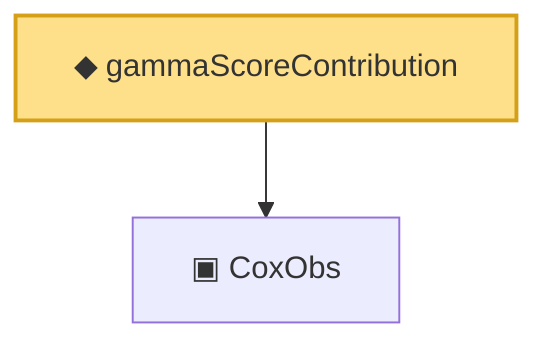

# Proof narrative — gammaScoreContribution

Root: **gammaScoreContribution** (noncomputable def) `Statlib/CoxChangePoint/Score.lean:52` · topic `CoxChangePoint`
Closure: 2 declarations across 2 files. Generated from `proof_graph.json` — no files were moved.

Reading order (foundations first, headline last):

  ▣ `CoxObs` — structure · `Statlib/CoxChangePoint/Foundation.lean:38`  _(also used by 42: TruncSample, benchmark_obs, coxScoreAt, …)_
◆ `gammaScoreContribution` — noncomputable def · `Statlib/CoxChangePoint/Score.lean:52` **← headline**

## Dependency diagram

