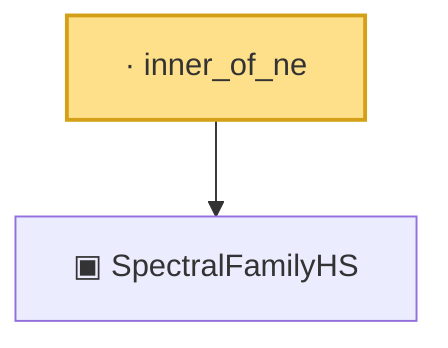

# Proof narrative — inner_of_ne

Root: **inner_of_ne** (lemma) `Statlib/CoxChangePoint/InfiniteDimSpectral.lean:117` · topic `CoxChangePoint`
Closure: 2 declarations across 1 files. Generated from `proof_graph.json` — no files were moved.

Reading order (foundations first, headline last):

  ▣ `SpectralFamilyHS` — structure · `Statlib/CoxChangePoint/InfiniteDimSpectral.lean:87`  _(also used by 14: inner_self_eq_one, norm_eigenfn, eigval_le_zero_term, …)_
· `inner_of_ne` — lemma · `Statlib/CoxChangePoint/InfiniteDimSpectral.lean:117` **← headline**

## Dependency diagram

