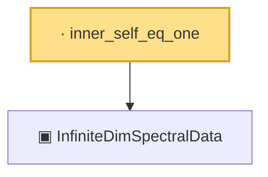

# Proof narrative — inner_self_eq_one

Root: **inner_self_eq_one** (lemma) `Statlib/CoxChangePoint/SpectralTheorem.lean:210` · topic `CoxChangePoint`
Closure: 2 declarations across 1 files. Generated from `proof_graph.json` — no files were moved.

Reading order (foundations first, headline last):

  ▣ `InfiniteDimSpectralData` — structure · `Statlib/CoxChangePoint/SpectralTheorem.lean:188`  _(also used by 6: inner_of_ne, InfiniteDimSpectralData.phiRepr, InfiniteDimSpectralData.phiRepr_meas, …)_
· `inner_self_eq_one` — lemma · `Statlib/CoxChangePoint/SpectralTheorem.lean:210` **← headline**

## Dependency diagram

