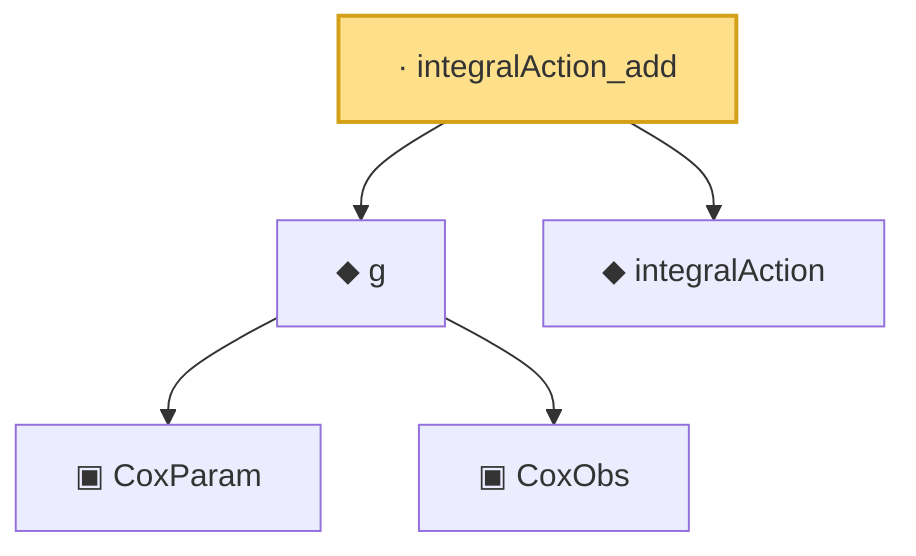

# Proof narrative — integralAction_add

Root: **integralAction_add** (lemma) `Statlib/CoxChangePoint/L2OperatorMap.lean:85` · topic `CoxChangePoint`
Closure: 5 declarations across 3 files. Generated from `proof_graph.json` — no files were moved.

Reading order (foundations first, headline last):

    ▣ `CoxParam` — structure · `Statlib/CoxChangePoint/Foundation.lean:57`  _(also used by 72: liftAuto, concreteGn, buildLemmaS1Data, …)_
    ▣ `CoxObs` — structure · `Statlib/CoxChangePoint/Foundation.lean:38`  _(also used by 42: TruncSample, benchmark_obs, coxScoreAt, …)_
  ◆ `g` — noncomputable def · `Statlib/CoxChangePoint/Foundation.lean:68`  _(also used by 18: AssumptionA7, exponential_moment_bound, HasFirstOrderTaylor, …)_
  ◆ `integralAction` — noncomputable def · `Statlib/CoxChangePoint/L2Operator.lean:68`  _(also used by 7: integralAction_sq_le, integralAction_symm, integralAction_sq_le_M, …)_
· `integralAction_add` — lemma · `Statlib/CoxChangePoint/L2OperatorMap.lean:85` **← headline**

## Dependency diagram

