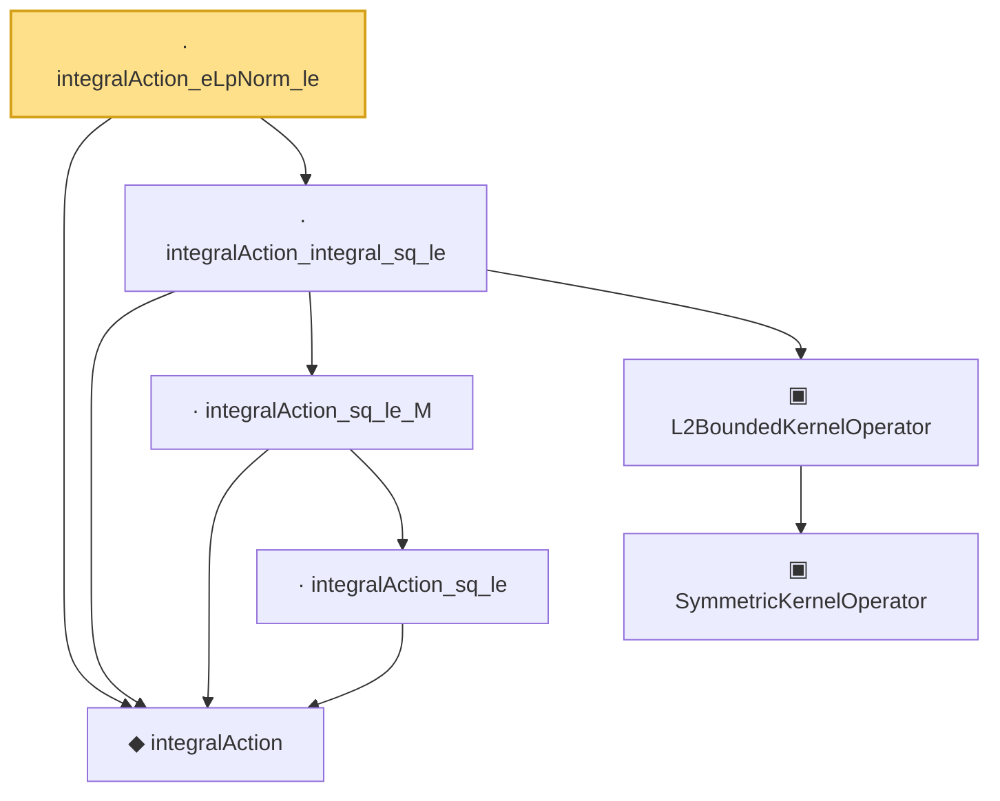

# Proof narrative — integralAction_eLpNorm_le

Root: **integralAction_eLpNorm_le** (lemma) `Statlib/CoxChangePoint/L2OperatorMap.lean:177` · topic `CoxChangePoint`
Closure: 7 declarations across 3 files. Generated from `proof_graph.json` — no files were moved.

Reading order (foundations first, headline last):

  ◆ `integralAction` — noncomputable def · `Statlib/CoxChangePoint/L2Operator.lean:68`  _(also used by 4: integralAction_symm, integralAction_add, integralAction_smul, …)_
      · `integralAction_sq_le` — lemma · `Statlib/CoxChangePoint/L2Operator.lean:84`
    · `integralAction_sq_le_M` — lemma · `Statlib/CoxChangePoint/L2Operator.lean:237`  _(also used by 1: integralAction_memLp_of_sq_bound)_
      ▣ `SymmetricKernelOperator` — structure · `Statlib/CoxChangePoint/SpectralOperator.lean:103`  _(also used by 4: L2BoundedKernelOperator.ofSymmetric, ofEmpiricalCov, HasEigendecomposition, …)_
    ▣ `L2BoundedKernelOperator` — structure · `Statlib/CoxChangePoint/L2Operator.lean:212`  _(also used by 6: L2BoundedKernelOperator.ofSymmetric, integralAction_smul, L2KernelMapData, …)_
  · `integralAction_integral_sq_le` — lemma · `Statlib/CoxChangePoint/L2Operator.lean:263`
· `integralAction_eLpNorm_le` — lemma · `Statlib/CoxChangePoint/L2OperatorMap.lean:177` **← headline**

## Dependency diagram

