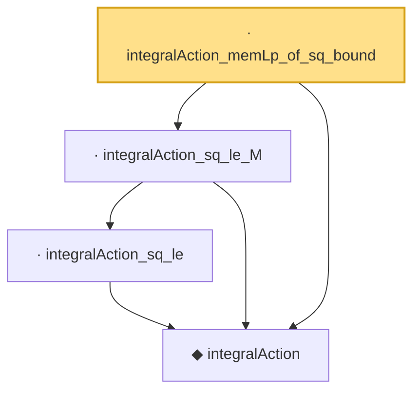

# Proof narrative — integralAction_memLp_of_sq_bound

Root: **integralAction_memLp_of_sq_bound** (lemma) `Statlib/CoxChangePoint/L2OperatorMap.lean:139` · topic `CoxChangePoint`
Closure: 4 declarations across 2 files. Generated from `proof_graph.json` — no files were moved.

Reading order (foundations first, headline last):

  ◆ `integralAction` — noncomputable def · `Statlib/CoxChangePoint/L2Operator.lean:68`  _(also used by 5: integralAction_symm, integralAction_integral_sq_le, integralAction_add, …)_
    · `integralAction_sq_le` — lemma · `Statlib/CoxChangePoint/L2Operator.lean:84`
  · `integralAction_sq_le_M` — lemma · `Statlib/CoxChangePoint/L2Operator.lean:237`  _(also used by 1: integralAction_integral_sq_le)_
· `integralAction_memLp_of_sq_bound` — lemma · `Statlib/CoxChangePoint/L2OperatorMap.lean:139` **← headline**

## Dependency diagram

