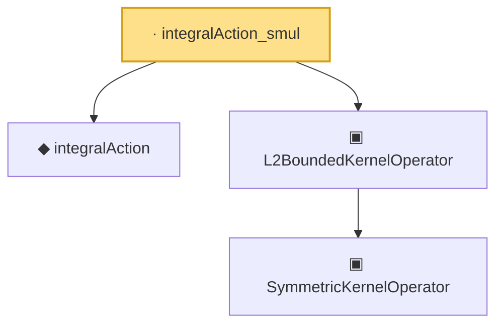

# Proof narrative — integralAction_smul

Root: **integralAction_smul** (lemma) `Statlib/CoxChangePoint/L2OperatorMap.lean:110` · topic `CoxChangePoint`
Closure: 4 declarations across 3 files. Generated from `proof_graph.json` — no files were moved.

Reading order (foundations first, headline last):

  ◆ `integralAction` — noncomputable def · `Statlib/CoxChangePoint/L2Operator.lean:68`  _(also used by 7: integralAction_sq_le, integralAction_symm, integralAction_sq_le_M, …)_
    ▣ `SymmetricKernelOperator` — structure · `Statlib/CoxChangePoint/SpectralOperator.lean:103`  _(also used by 4: L2BoundedKernelOperator.ofSymmetric, ofEmpiricalCov, HasEigendecomposition, …)_
  ▣ `L2BoundedKernelOperator` — structure · `Statlib/CoxChangePoint/L2Operator.lean:212`  _(also used by 6: integralAction_integral_sq_le, L2BoundedKernelOperator.ofSymmetric, L2KernelMapData, …)_
· `integralAction_smul` — lemma · `Statlib/CoxChangePoint/L2OperatorMap.lean:110` **← headline**

## Dependency diagram

