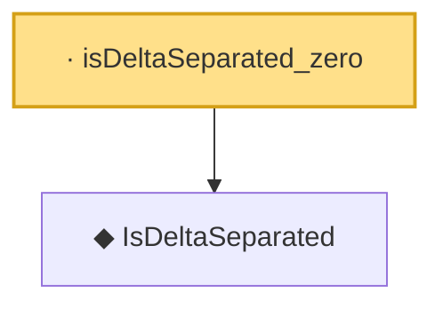

# Proof narrative — isDeltaSeparated_zero

Root: **isDeltaSeparated_zero** (lemma) `Statlib/CoxChangePoint/Chaining.lean:121` · topic `CoxChangePoint`
Closure: 2 declarations across 1 files. Generated from `proof_graph.json` — no files were moved.

Reading order (foundations first, headline last):

  ◆ `IsDeltaSeparated` — def · `Statlib/CoxChangePoint/Chaining.lean:107`  _(also used by 1: PackingNumber)_
· `isDeltaSeparated_zero` — lemma · `Statlib/CoxChangePoint/Chaining.lean:121` **← headline**

## Dependency diagram

