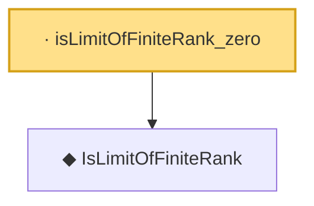

# Proof narrative — isLimitOfFiniteRank_zero

Root: **isLimitOfFiniteRank_zero** (lemma) `Statlib/CoxChangePoint/InfiniteDimSpectral.lean:278` · topic `CoxChangePoint`
Closure: 2 declarations across 1 files. Generated from `proof_graph.json` — no files were moved.

Reading order (foundations first, headline last):

  ◆ `IsLimitOfFiniteRank` — def · `Statlib/CoxChangePoint/InfiniteDimSpectral.lean:270`
· `isLimitOfFiniteRank_zero` — lemma · `Statlib/CoxChangePoint/InfiniteDimSpectral.lean:278` **← headline**

## Dependency diagram

