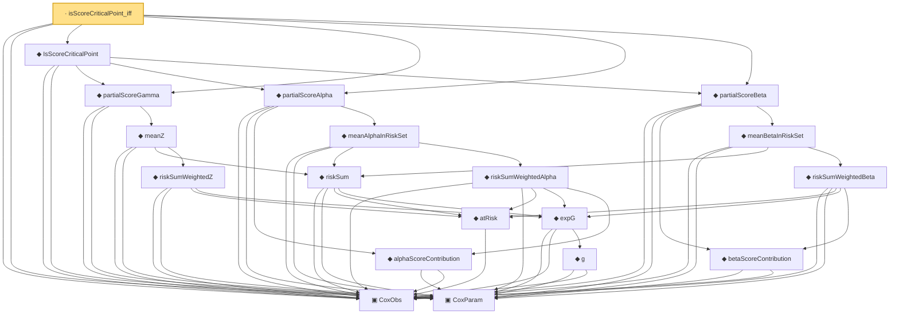

# Proof narrative — isScoreCriticalPoint_iff

Root: **isScoreCriticalPoint_iff** (lemma) `Statlib/CoxChangePoint/ScoreEquation.lean:58` · topic `CoxChangePoint`
Closure: 19 declarations across 3 files. Generated from `proof_graph.json` — no files were moved.

Reading order (foundations first, headline last):

  ▣ `CoxObs` — structure · `Statlib/CoxChangePoint/Foundation.lean:38`  _(also used by 26: TruncSample, benchmark_obs, coxScoreAt, …)_
  ▣ `CoxParam` — structure · `Statlib/CoxChangePoint/Foundation.lean:57`  _(also used by 57: liftAuto, concreteGn, buildLemmaS1Data, …)_
          ◆ `atRisk` — noncomputable def · `Statlib/CoxChangePoint/Foundation.lean:89`
            ◆ `g` — noncomputable def · `Statlib/CoxChangePoint/Foundation.lean:68`  _(also used by 18: AssumptionA7, exponential_moment_bound, HasFirstOrderTaylor, …)_
          ◆ `expG` — noncomputable def · `Statlib/CoxChangePoint/Foundation.lean:75`  _(also used by 1: expG_pos)_
        ◆ `riskSum` — noncomputable def · `Statlib/CoxChangePoint/Foundation.lean:93`  _(also used by 2: riskSum_nonneg, logPartialLikelihood)_
        ◆ `riskSumWeightedZ` — noncomputable def · `Statlib/CoxChangePoint/Score.lean:74`
      ◆ `meanZ` — noncomputable def · `Statlib/CoxChangePoint/Score.lean:102`
  ◆ `partialScoreGamma` — noncomputable def · `Statlib/CoxChangePoint/Score.lean:137`  _(also used by 1: coxScoreAt)_
      ◆ `alphaScoreContribution` — noncomputable def · `Statlib/CoxChangePoint/Score.lean:57`
        ◆ `riskSumWeightedAlpha` — noncomputable def · `Statlib/CoxChangePoint/Score.lean:80`
      ◆ `meanAlphaInRiskSet` — noncomputable def · `Statlib/CoxChangePoint/Score.lean:110`
  ◆ `partialScoreAlpha` — noncomputable def · `Statlib/CoxChangePoint/Score.lean:148`  _(also used by 1: coxScoreAt)_
      ◆ `betaScoreContribution` — noncomputable def · `Statlib/CoxChangePoint/Score.lean:63`
        ◆ `riskSumWeightedBeta` — noncomputable def · `Statlib/CoxChangePoint/Score.lean:87`
      ◆ `meanBetaInRiskSet` — noncomputable def · `Statlib/CoxChangePoint/Score.lean:118`
  ◆ `partialScoreBeta` — noncomputable def · `Statlib/CoxChangePoint/Score.lean:160`  _(also used by 1: coxScoreAt)_
  ◆ `IsScoreCriticalPoint` — def · `Statlib/CoxChangePoint/ScoreEquation.lean:52`
· `isScoreCriticalPoint_iff` — lemma · `Statlib/CoxChangePoint/ScoreEquation.lean:58` **← headline**

## Dependency diagram

