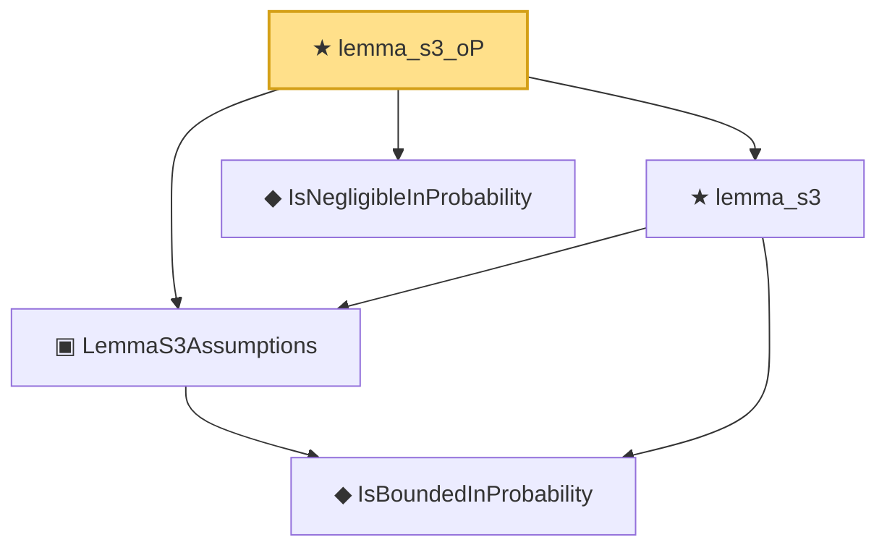

# Proof narrative — lemma_s3_oP

Root: **lemma_s3_oP** (theorem) `Statlib/CoxChangePoint/RemainderTailOp.lean:170` · topic `CoxChangePoint`
Closure: 5 declarations across 2 files. Generated from `proof_graph.json` — no files were moved.

Reading order (foundations first, headline last):

    ◆ `IsBoundedInProbability` — def · `Statlib/EmpiricalProcess/StochasticOrder.lean:42`  _(also used by 19: rate, toRate, cox_theorem_2_end_to_end, …)_
  ▣ `LemmaS3Assumptions` — structure · `Statlib/CoxChangePoint/RemainderTailOp.lean:47`
  ◆ `IsNegligibleInProbability` — def · `Statlib/EmpiricalProcess/StochasticOrder.lean:49`  _(also used by 7: IsNegligibleInProbability.isBoundedInProbability, IsNegligibleInProbability.add, isNegligibleInProbability_zero, …)_
  ★ `lemma_s3` — theorem · `Statlib/CoxChangePoint/RemainderTailOp.lean:128`
★ `lemma_s3_oP` — theorem · `Statlib/CoxChangePoint/RemainderTailOp.lean:170` **← headline**

## Dependency diagram

