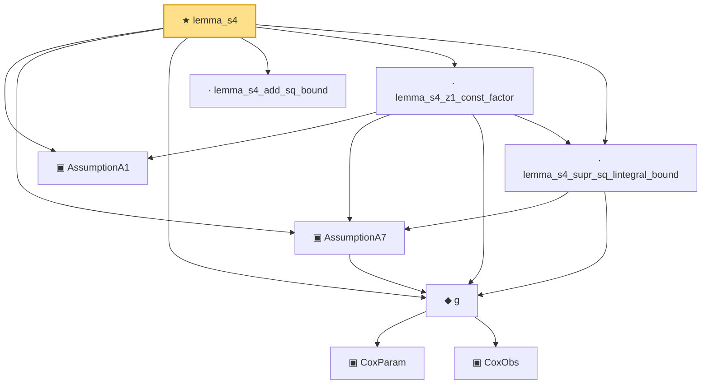

# Proof narrative — lemma_s4

Root: **lemma_s4** (theorem) `Statlib/CoxChangePoint/SupProductSquareIntegrable.lean:154` · topic `CoxChangePoint`
Closure: 9 declarations across 2 files. Generated from `proof_graph.json` — no files were moved.

Reading order (foundations first, headline last):

  ▣ `AssumptionA1` — structure · `Statlib/CoxChangePoint/SupProductSquareIntegrable.lean:10`
      ▣ `CoxParam` — structure · `Statlib/CoxChangePoint/Foundation.lean:57`  _(also used by 72: liftAuto, concreteGn, buildLemmaS1Data, …)_
      ▣ `CoxObs` — structure · `Statlib/CoxChangePoint/Foundation.lean:38`  _(also used by 42: TruncSample, benchmark_obs, coxScoreAt, …)_
  ◆ `g` — noncomputable def · `Statlib/CoxChangePoint/Foundation.lean:68`  _(also used by 16: AssumptionA7, exponential_moment_bound, HasFirstOrderTaylor, …)_
  ▣ `AssumptionA7` — structure · `Statlib/CoxChangePoint/SupProductSquareIntegrable.lean:18`
  · `lemma_s4_add_sq_bound` — private lemma · `Statlib/CoxChangePoint/SupProductSquareIntegrable.lean:45`
  · `lemma_s4_supr_sq_lintegral_bound` — private lemma · `Statlib/CoxChangePoint/SupProductSquareIntegrable.lean:60`
  · `lemma_s4_z1_const_factor` — private lemma · `Statlib/CoxChangePoint/SupProductSquareIntegrable.lean:86`
★ `lemma_s4` — theorem · `Statlib/CoxChangePoint/SupProductSquareIntegrable.lean:154` **← headline**

## Dependency diagram

