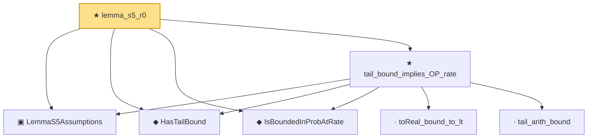

# Proof narrative — lemma_s5_r0

Root: **lemma_s5_r0** (theorem) `Statlib/CoxChangePoint/UniformProcessOpRate.lean:275` · topic `CoxChangePoint`
Closure: 7 declarations across 1 files. Generated from `proof_graph.json` — no files were moved.

Reading order (foundations first, headline last):

  ▣ `LemmaS5Assumptions` — structure · `Statlib/CoxChangePoint/UniformProcessOpRate.lean:22`  _(also used by 2: union_bound_tail, lemma_s5)_
  ◆ `HasTailBound` — def · `Statlib/CoxChangePoint/UniformProcessOpRate.lean:45`  _(also used by 2: union_bound_tail, lemma_s5)_
  ◆ `IsBoundedInProbAtRate` — def · `Statlib/CoxChangePoint/UniformProcessOpRate.lean:36`  _(also used by 1: lemma_s5)_
    · `toReal_bound_to_lt` — private lemma · `Statlib/CoxChangePoint/UniformProcessOpRate.lean:81`
    · `tail_arith_bound` — private lemma · `Statlib/CoxChangePoint/UniformProcessOpRate.lean:54`
  ★ `tail_bound_implies_OP_rate` — theorem · `Statlib/CoxChangePoint/UniformProcessOpRate.lean:99`  _(also used by 1: lemma_s5)_
★ `lemma_s5_r0` — theorem · `Statlib/CoxChangePoint/UniformProcessOpRate.lean:275` **← headline**

## Dependency diagram

