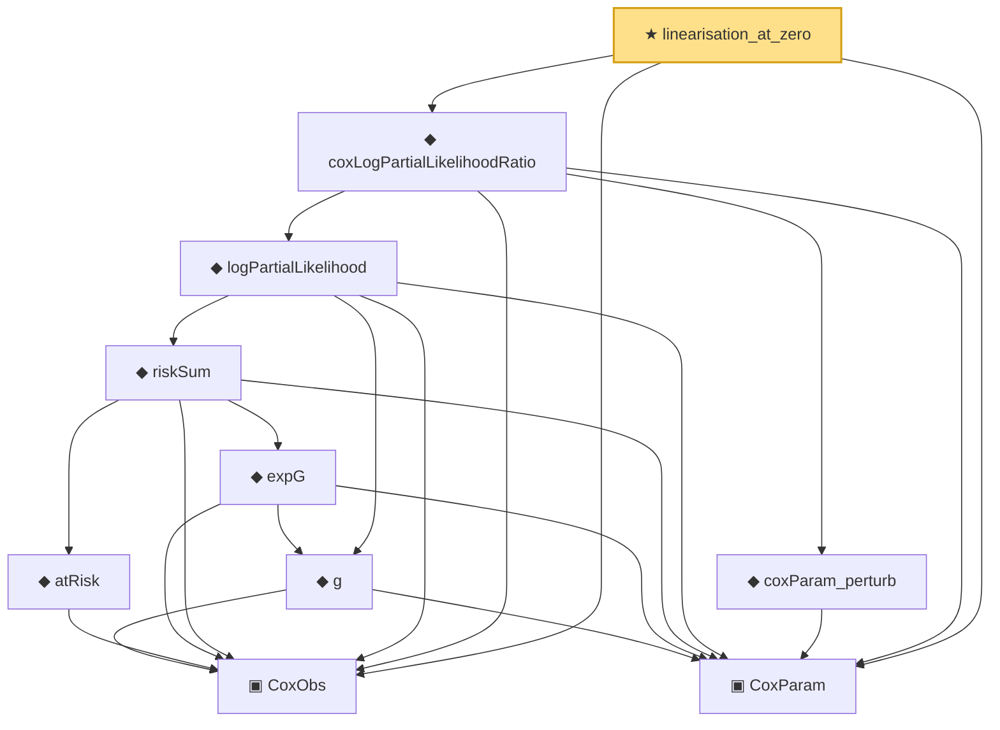

# Proof narrative — linearisation_at_zero

Root: **linearisation_at_zero** (theorem) `Statlib/CoxChangePoint/CoxTaylor.lean:170` · topic `CoxChangePoint`
Closure: 10 declarations across 3 files. Generated from `proof_graph.json` — no files were moved.

Reading order (foundations first, headline last):

  ▣ `CoxObs` — structure · `Statlib/CoxChangePoint/Foundation.lean:38`  _(also used by 36: TruncSample, benchmark_obs, coxScoreAt, …)_
  ▣ `CoxParam` — structure · `Statlib/CoxChangePoint/Foundation.lean:57`  _(also used by 66: liftAuto, concreteGn, buildLemmaS1Data, …)_
      ◆ `g` — noncomputable def · `Statlib/CoxChangePoint/Foundation.lean:68`  _(also used by 17: AssumptionA7, exponential_moment_bound, HasFirstOrderTaylor, …)_
        ◆ `atRisk` — noncomputable def · `Statlib/CoxChangePoint/Foundation.lean:89`  _(also used by 3: riskSumWeightedZ, riskSumWeightedAlpha, riskSumWeightedBeta)_
        ◆ `expG` — noncomputable def · `Statlib/CoxChangePoint/Foundation.lean:75`  _(also used by 4: expG_pos, riskSumWeightedZ, riskSumWeightedAlpha, …)_
      ◆ `riskSum` — noncomputable def · `Statlib/CoxChangePoint/Foundation.lean:93`  _(also used by 4: riskSum_nonneg, meanZ, meanAlphaInRiskSet, …)_
    ◆ `logPartialLikelihood` — noncomputable def · `Statlib/CoxChangePoint/Foundation.lean:104`  _(also used by 6: CoxFirstOrderTaylor, Gn, IsLikelihoodArgmax, …)_
    ◆ `coxParam_perturb` — noncomputable def · `Statlib/CoxChangePoint/CoxLAN.lean:116`  _(also used by 2: toLANExpansion, CoxFirstOrderTaylor)_
  ◆ `coxLogPartialLikelihoodRatio` — noncomputable def · `Statlib/CoxChangePoint/CoxLAN.lean:155`  _(also used by 4: CoxLANExpansionHypothesis, coxLogRatio, toLANExpansion, …)_
★ `linearisation_at_zero` — theorem · `Statlib/CoxChangePoint/CoxTaylor.lean:170` **← headline**

## Dependency diagram

