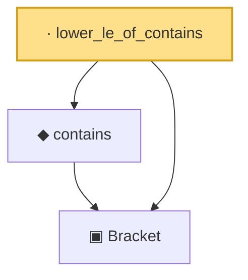

# Proof narrative — lower_le_of_contains

Root: **lower_le_of_contains** (lemma) `Statlib/CoxChangePoint/BracketingEntropy.lean:86` · topic `CoxChangePoint`
Closure: 3 declarations across 1 files. Generated from `proof_graph.json` — no files were moved.

Reading order (foundations first, headline last):

  ▣ `Bracket` — structure · `Statlib/CoxChangePoint/BracketingEntropy.lean:58`  _(also used by 3: le_upper_of_contains, HasBracketing, bracketingCardinalities)_
  ◆ `contains` — def · `Statlib/CoxChangePoint/BracketingEntropy.lean:79`  _(also used by 3: le_upper_of_contains, HasBracketing, bracketingCardinalities)_
· `lower_le_of_contains` — lemma · `Statlib/CoxChangePoint/BracketingEntropy.lean:86` **← headline**

## Dependency diagram

