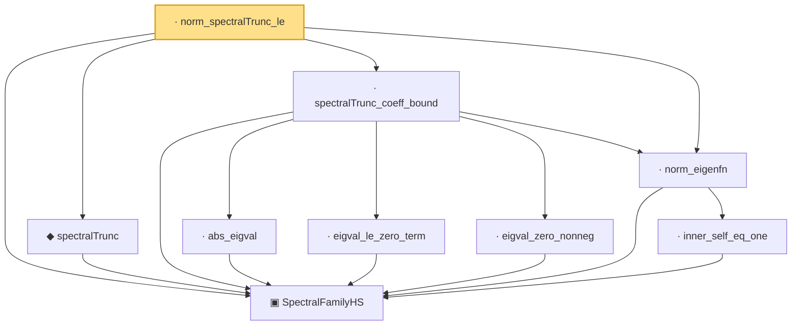

# Proof narrative — norm_spectralTrunc_le

Root: **norm_spectralTrunc_le** (lemma) `Statlib/CoxChangePoint/InfiniteDimSpectral.lean:212` · topic `CoxChangePoint`
Closure: 9 declarations across 1 files. Generated from `proof_graph.json` — no files were moved.

Reading order (foundations first, headline last):

  ▣ `SpectralFamilyHS` — structure · `Statlib/CoxChangePoint/InfiniteDimSpectral.lean:87`  _(also used by 7: inner_of_ne, HasSpectralExpansion, SpectralFamilyHS.phiRepr, …)_
  ◆ `spectralTrunc` — noncomputable def · `Statlib/CoxChangePoint/InfiniteDimSpectral.lean:169`  _(also used by 1: HasSpectralExpansion)_
    · `abs_eigval` — lemma · `Statlib/CoxChangePoint/InfiniteDimSpectral.lean:148`
    · `eigval_le_zero_term` — lemma · `Statlib/CoxChangePoint/InfiniteDimSpectral.lean:136`
    · `eigval_zero_nonneg` — lemma · `Statlib/CoxChangePoint/InfiniteDimSpectral.lean:144`
      · `inner_self_eq_one` — lemma · `Statlib/CoxChangePoint/InfiniteDimSpectral.lean:111`
  · `norm_eigenfn` — lemma · `Statlib/CoxChangePoint/InfiniteDimSpectral.lean:124`
  · `spectralTrunc_coeff_bound` — lemma · `Statlib/CoxChangePoint/InfiniteDimSpectral.lean:174`
· `norm_spectralTrunc_le` — lemma · `Statlib/CoxChangePoint/InfiniteDimSpectral.lean:212` **← headline**

## Dependency diagram

