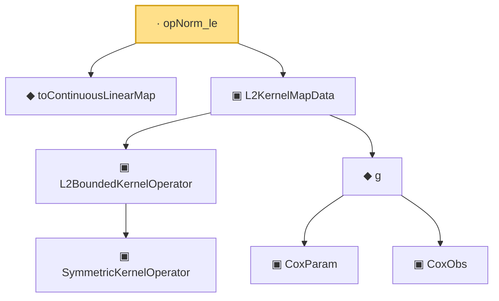

# Proof narrative — opNorm_le

Root: **opNorm_le** (lemma) `Statlib/CoxChangePoint/L2OperatorMap.lean:246` · topic `CoxChangePoint`
Closure: 8 declarations across 4 files. Generated from `proof_graph.json` — no files were moved.

Reading order (foundations first, headline last):

  ◆ `toContinuousLinearMap` — def · `Statlib/CoxChangePoint/L2OperatorMap.lean:239`  _(also used by 12: SpectralFamilyHS.phiRepr, SpectralFamilyHS.phiRepr_meas, SpectralFamilyHS.toEigensystem, …)_
      ▣ `SymmetricKernelOperator` — structure · `Statlib/CoxChangePoint/SpectralOperator.lean:103`  _(also used by 4: L2BoundedKernelOperator.ofSymmetric, ofEmpiricalCov, HasEigendecomposition, …)_
    ▣ `L2BoundedKernelOperator` — structure · `Statlib/CoxChangePoint/L2Operator.lean:212`  _(also used by 6: integralAction_integral_sq_le, L2BoundedKernelOperator.ofSymmetric, integralAction_smul, …)_
      ▣ `CoxParam` — structure · `Statlib/CoxChangePoint/Foundation.lean:57`  _(also used by 72: liftAuto, concreteGn, buildLemmaS1Data, …)_
      ▣ `CoxObs` — structure · `Statlib/CoxChangePoint/Foundation.lean:38`  _(also used by 42: TruncSample, benchmark_obs, coxScoreAt, …)_
    ◆ `g` — noncomputable def · `Statlib/CoxChangePoint/Foundation.lean:68`  _(also used by 18: AssumptionA7, exponential_moment_bound, HasFirstOrderTaylor, …)_
  ▣ `L2KernelMapData` — structure · `Statlib/CoxChangePoint/L2OperatorMap.lean:204`  _(also used by 12: SpectralFamilyHS.phiRepr, SpectralFamilyHS.phiRepr_meas, SpectralFamilyHS.toEigensystem, …)_
· `opNorm_le` — lemma · `Statlib/CoxChangePoint/L2OperatorMap.lean:246` **← headline**

## Dependency diagram

