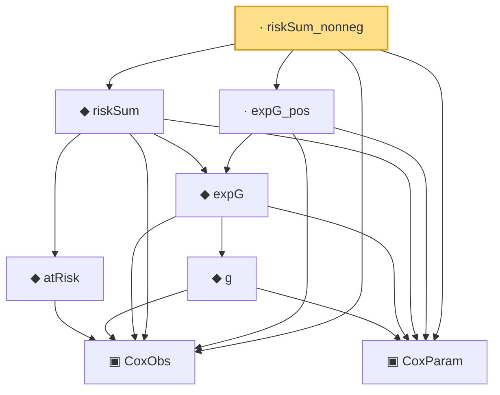

# Proof narrative — riskSum_nonneg

Root: **riskSum_nonneg** (lemma) `Statlib/CoxChangePoint/Foundation.lean:97` · topic `CoxChangePoint`
Closure: 8 declarations across 1 files. Generated from `proof_graph.json` — no files were moved.

Reading order (foundations first, headline last):

  ▣ `CoxObs` — structure · `Statlib/CoxChangePoint/Foundation.lean:38`  _(also used by 37: TruncSample, benchmark_obs, coxScoreAt, …)_
  ▣ `CoxParam` — structure · `Statlib/CoxChangePoint/Foundation.lean:57`  _(also used by 68: liftAuto, concreteGn, buildLemmaS1Data, …)_
    ◆ `atRisk` — noncomputable def · `Statlib/CoxChangePoint/Foundation.lean:89`  _(also used by 3: riskSumWeightedZ, riskSumWeightedAlpha, riskSumWeightedBeta)_
      ◆ `g` — noncomputable def · `Statlib/CoxChangePoint/Foundation.lean:68`  _(also used by 18: AssumptionA7, exponential_moment_bound, HasFirstOrderTaylor, …)_
    ◆ `expG` — noncomputable def · `Statlib/CoxChangePoint/Foundation.lean:75`  _(also used by 3: riskSumWeightedZ, riskSumWeightedAlpha, riskSumWeightedBeta)_
  ◆ `riskSum` — noncomputable def · `Statlib/CoxChangePoint/Foundation.lean:93`  _(also used by 4: logPartialLikelihood, meanZ, meanAlphaInRiskSet, …)_
  · `expG_pos` — lemma · `Statlib/CoxChangePoint/Foundation.lean:78`
· `riskSum_nonneg` — lemma · `Statlib/CoxChangePoint/Foundation.lean:97` **← headline**

## Dependency diagram

