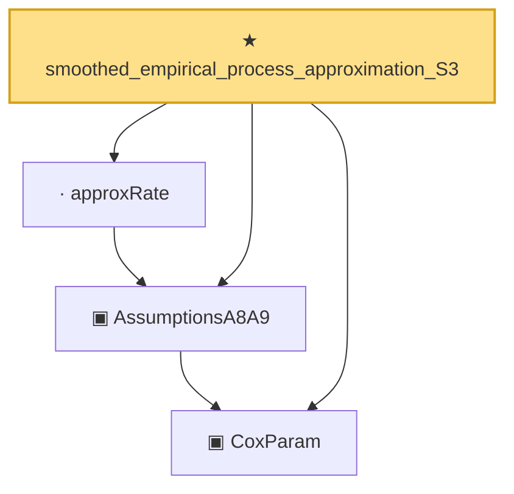

# Proof narrative — smoothed_empirical_process_approximation_S3

Root: **smoothed_empirical_process_approximation_S3** (theorem) `Statlib/CoxChangePoint/Auto/smoothed_empirical_process_approximation.lean:97` · topic `CoxChangePoint`
Closure: 4 declarations across 1 files. Generated from `proof_graph.json` — no files were moved.

Reading order (foundations first, headline last):

  ▣ `CoxParam` — private structure · `Statlib/CoxChangePoint/Auto/smoothed_empirical_process_approximation.lean:18`  _(also used by 11: smoothed_empirical_process_approximation_S1, smoothed_empirical_process_approximation_S2, smoothed_empirical_process_approximation, …)_
  ▣ `AssumptionsA8A9` — private structure · `Statlib/CoxChangePoint/Auto/smoothed_empirical_process_approximation.lean:26`  _(also used by 3: smoothed_empirical_process_approximation_S1, smoothed_empirical_process_approximation_S2, smoothed_empirical_process_approximation)_
  · `approxRate` — private noncomputable def · `Statlib/CoxChangePoint/Auto/smoothed_empirical_process_approximation.lean:48`  _(also used by 3: smoothed_empirical_process_approximation_S1, smoothed_empirical_process_approximation_S2, smoothed_empirical_process_approximation)_
★ `smoothed_empirical_process_approximation_S3` — theorem · `Statlib/CoxChangePoint/Auto/smoothed_empirical_process_approximation.lean:97` **← headline**

## Dependency diagram

