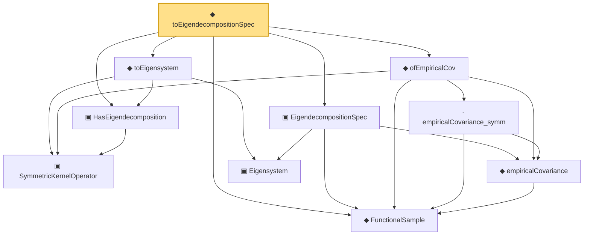

# Proof narrative — toEigendecompositionSpec

Root: **toEigendecompositionSpec** (def) `Statlib/CoxChangePoint/SpectralOperator.lean:240` · topic `CoxChangePoint`
Closure: 10 declarations across 3 files. Generated from `proof_graph.json` — no files were moved.

Reading order (foundations first, headline last):

  ◆ `FunctionalSample` — def · `Statlib/CoxChangePoint/FPC.lean:55`  _(also used by 10: CoxModel, fpcScore, truncatedScores, …)_
    ▣ `SymmetricKernelOperator` — structure · `Statlib/CoxChangePoint/SpectralOperator.lean:103`  _(also used by 2: L2BoundedKernelOperator, L2BoundedKernelOperator.ofSymmetric)_
  ▣ `HasEigendecomposition` — structure · `Statlib/CoxChangePoint/SpectralOperator.lean:193`
    ◆ `empiricalCovariance` — noncomputable def · `Statlib/CoxChangePoint/FPC.lean:86`
    · `empiricalCovariance_symm` — lemma · `Statlib/CoxChangePoint/SpectralOperator.lean:126`
  ◆ `ofEmpiricalCov` — def · `Statlib/CoxChangePoint/SpectralOperator.lean:147`
    ▣ `Eigensystem` — structure · `Statlib/CoxChangePoint/FPC.lean:42`  _(also used by 21: benchmark_eigsys, CoxModel, fpcScore, …)_
  ▣ `EigendecompositionSpec` — structure · `Statlib/CoxChangePoint/SpectralBridge.lean:64`  _(also used by 1: EstimatedEigensystem.fromSpec)_
  ◆ `toEigensystem` — def · `Statlib/CoxChangePoint/SpectralOperator.lean:226`  _(also used by 4: SpectralFamilyHS.toEigensystem, SpectralFamilyHS.toEigensystem_lam_summable_sq, SpectralFamilyHS.toEigensystem_lam_decreasing, …)_
◆ `toEigendecompositionSpec` — def · `Statlib/CoxChangePoint/SpectralOperator.lean:240` **← headline**

## Dependency diagram

