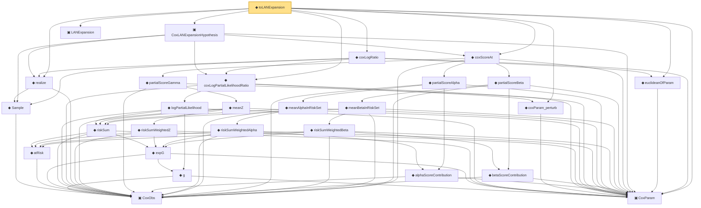

# Proof narrative — toLANExpansion

Root: **toLANExpansion** (noncomputable def) `Statlib/CoxChangePoint/CoxLAN.lean:279` · topic `CoxChangePoint`
Closure: 28 declarations across 4 files. Generated from `proof_graph.json` — no files were moved.

Reading order (foundations first, headline last):

      ▣ `CoxObs` — structure · `Statlib/CoxChangePoint/Foundation.lean:38`  _(also used by 23: TruncSample, benchmark_obs, coxScoreAt_dim_match, …)_
    ◆ `Sample` — def · `Statlib/CoxChangePoint/Foundation.lean:127`  _(also used by 21: benchmark_sample, sample, CoxFirstOrderTaylor, …)_
  ▣ `CoxParam` — structure · `Statlib/CoxChangePoint/Foundation.lean:57`  _(also used by 51: liftAuto, concreteGn, buildLemmaS1Data, …)_
        ◆ `g` — noncomputable def · `Statlib/CoxChangePoint/Foundation.lean:68`  _(also used by 17: AssumptionA7, exponential_moment_bound, HasFirstOrderTaylor, …)_
          ◆ `atRisk` — noncomputable def · `Statlib/CoxChangePoint/Foundation.lean:89`
          ◆ `expG` — noncomputable def · `Statlib/CoxChangePoint/Foundation.lean:75`  _(also used by 1: expG_pos)_
        ◆ `riskSum` — noncomputable def · `Statlib/CoxChangePoint/Foundation.lean:93`  _(also used by 1: riskSum_nonneg)_
      ◆ `logPartialLikelihood` — noncomputable def · `Statlib/CoxChangePoint/Foundation.lean:104`  _(also used by 6: CoxFirstOrderTaylor, Gn, IsLikelihoodArgmax, …)_
  ◆ `coxParam_perturb` — noncomputable def · `Statlib/CoxChangePoint/CoxLAN.lean:116`  _(also used by 1: CoxFirstOrderTaylor)_
  ◆ `coxLogPartialLikelihoodRatio` — noncomputable def · `Statlib/CoxChangePoint/CoxLAN.lean:155`  _(also used by 2: linearisation_at_zero, toCoxLANExpansionHypothesis)_
  ◆ `realize` — def · `Statlib/CoxChangePoint/Foundation.lean:135`  _(also used by 9: CoxFirstOrderTaylor, toCoxLANExpansionHypothesis, Gn, …)_
          ◆ `riskSumWeightedZ` — noncomputable def · `Statlib/CoxChangePoint/Score.lean:74`
        ◆ `meanZ` — noncomputable def · `Statlib/CoxChangePoint/Score.lean:102`
      ◆ `partialScoreGamma` — noncomputable def · `Statlib/CoxChangePoint/Score.lean:137`  _(also used by 2: IsScoreCriticalPoint, isScoreCriticalPoint_iff)_
        ◆ `alphaScoreContribution` — noncomputable def · `Statlib/CoxChangePoint/Score.lean:57`
          ◆ `riskSumWeightedAlpha` — noncomputable def · `Statlib/CoxChangePoint/Score.lean:80`
        ◆ `meanAlphaInRiskSet` — noncomputable def · `Statlib/CoxChangePoint/Score.lean:110`
      ◆ `partialScoreAlpha` — noncomputable def · `Statlib/CoxChangePoint/Score.lean:148`  _(also used by 2: IsScoreCriticalPoint, isScoreCriticalPoint_iff)_
        ◆ `betaScoreContribution` — noncomputable def · `Statlib/CoxChangePoint/Score.lean:63`
          ◆ `riskSumWeightedBeta` — noncomputable def · `Statlib/CoxChangePoint/Score.lean:87`
        ◆ `meanBetaInRiskSet` — noncomputable def · `Statlib/CoxChangePoint/Score.lean:118`
      ◆ `partialScoreBeta` — noncomputable def · `Statlib/CoxChangePoint/Score.lean:160`  _(also used by 2: IsScoreCriticalPoint, isScoreCriticalPoint_iff)_
  ◆ `coxScoreAt` — noncomputable def · `Statlib/CoxChangePoint/CoxLAN.lean:87`  _(also used by 3: coxScoreAt_dim_match, CoxFirstOrderTaylor, toCoxLANExpansionHypothesis)_
  ▣ `CoxLANExpansionHypothesis` — structure · `Statlib/CoxChangePoint/CoxLAN.lean:199`  _(also used by 1: toCoxLANExpansionHypothesis)_
  ▣ `LANExpansion` — structure · `Statlib/Mathlib/Statistics/LAN.lean:152`  _(also used by 9: CoxModel.toCoxTheorem3Hypotheses, cox_theorem_3_end_to_end, expansion_zero, …)_
  ◆ `euclideanOfParam` — noncomputable def · `Statlib/CoxChangePoint/CoxLAN.lean:240`
  ◆ `coxLogRatio` — noncomputable def · `Statlib/CoxChangePoint/CoxLAN.lean:261`
◆ `toLANExpansion` — noncomputable def · `Statlib/CoxChangePoint/CoxLAN.lean:279` **← headline**

## Dependency diagram

