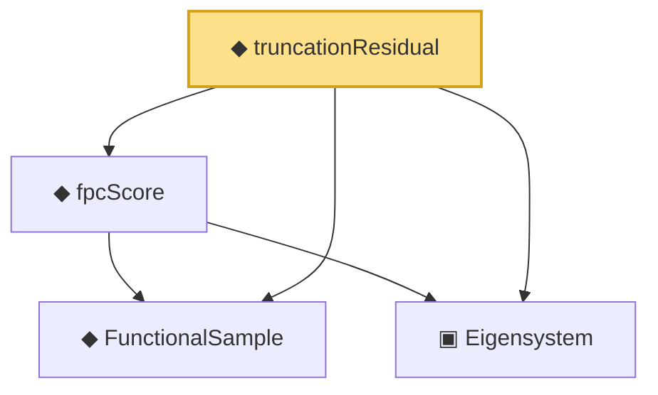

# Proof narrative — truncationResidual

Root: **truncationResidual** (noncomputable def) `Statlib/CoxChangePoint/FPC.lean:74` · topic `CoxChangePoint`
Closure: 4 declarations across 1 files. Generated from `proof_graph.json` — no files were moved.

Reading order (foundations first, headline last):

  ◆ `FunctionalSample` — def · `Statlib/CoxChangePoint/FPC.lean:55`  _(also used by 13: CoxModel, truncatedScores, empiricalCovariance, …)_
  ▣ `Eigensystem` — structure · `Statlib/CoxChangePoint/FPC.lean:42`  _(also used by 21: benchmark_eigsys, CoxModel, truncatedScores, …)_
  ◆ `fpcScore` — noncomputable def · `Statlib/CoxChangePoint/FPC.lean:64`  _(also used by 2: truncatedScores, fpcScoreError)_
◆ `truncationResidual` — noncomputable def · `Statlib/CoxChangePoint/FPC.lean:74` **← headline**

## Dependency diagram

