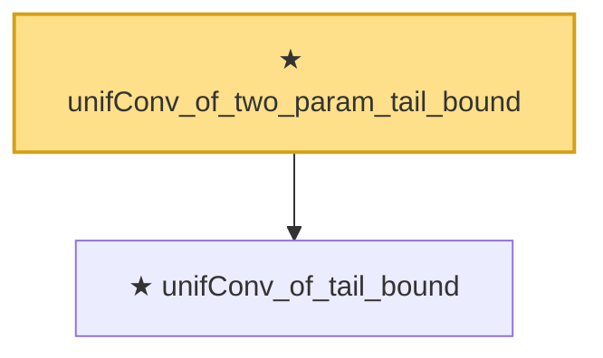

# Proof narrative — unifConv_of_two_param_tail_bound

Root: **unifConv_of_two_param_tail_bound** (theorem) `Statlib/CoxChangePoint/LemmaS1Abstract.lean:153` · topic `CoxChangePoint`
Closure: 2 declarations across 1 files. Generated from `proof_graph.json` — no files were moved.

Reading order (foundations first, headline last):

  ★ `unifConv_of_tail_bound` — theorem · `Statlib/CoxChangePoint/LemmaS1Abstract.lean:77`  _(also used by 1: unifConv_of_VW_2_14_9_conclusion)_
★ `unifConv_of_two_param_tail_bound` — theorem · `Statlib/CoxChangePoint/LemmaS1Abstract.lean:153` **← headline**

## Dependency diagram

