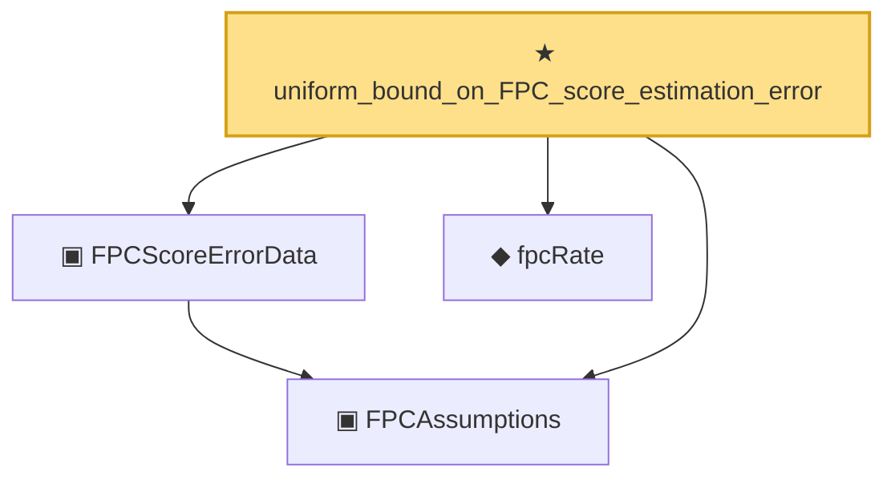

# Proof narrative — uniform_bound_on_FPC_score_estimation_error

Root: **uniform_bound_on_FPC_score_estimation_error** (theorem) `Statlib/CoxChangePoint/Auto/uniform_bound_on_FPC_score_estimation_error.lean:72` · topic `CoxChangePoint`
Closure: 4 declarations across 1 files. Generated from `proof_graph.json` — no files were moved.

Reading order (foundations first, headline last):

  ▣ `FPCAssumptions` — private structure · `Statlib/CoxChangePoint/Auto/uniform_bound_on_FPC_score_estimation_error.lean:20`
  ▣ `FPCScoreErrorData` — private structure · `Statlib/CoxChangePoint/Auto/uniform_bound_on_FPC_score_estimation_error.lean:50`
  ◆ `fpcRate` — private def · `Statlib/CoxChangePoint/Auto/uniform_bound_on_FPC_score_estimation_error.lean:69`
★ `uniform_bound_on_FPC_score_estimation_error` — theorem · `Statlib/CoxChangePoint/Auto/uniform_bound_on_FPC_score_estimation_error.lean:72` **← headline**

## Dependency diagram

