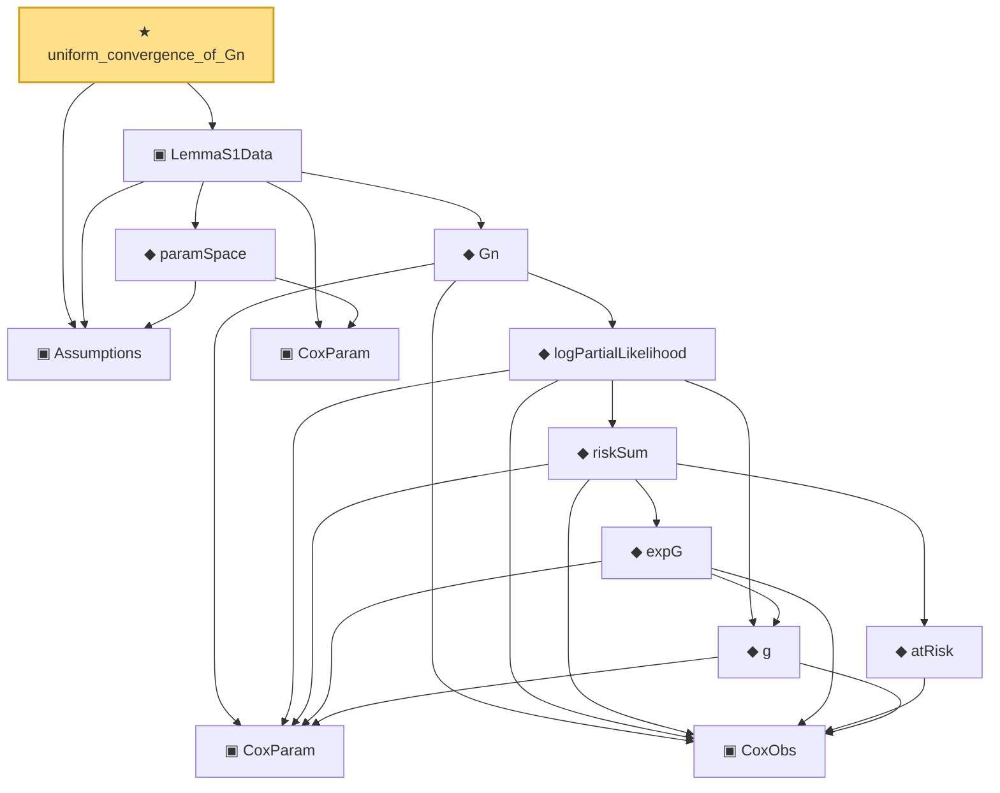

# Proof narrative — uniform_convergence_of_Gn

Root: **uniform_convergence_of_Gn** (theorem) `Statlib/CoxChangePoint/Auto/uniform_convergence_of_Gn.lean:106` · topic `CoxChangePoint`
Closure: 13 declarations across 2 files. Generated from `proof_graph.json` — no files were moved.

Reading order (foundations first, headline last):

  ▣ `Assumptions` — structure · `Statlib/CoxChangePoint/Auto/uniform_convergence_of_Gn.lean:37`  _(also used by 3: TruncSample, concreteGn, buildLemmaS1Data)_
      ▣ `CoxObs` — structure · `Statlib/CoxChangePoint/Foundation.lean:38`  _(also used by 37: TruncSample, benchmark_obs, coxScoreAt, …)_
      ▣ `CoxParam` — structure · `Statlib/CoxChangePoint/Foundation.lean:57`  _(also used by 69: liftAuto, concreteGn, buildLemmaS1Data, …)_
        ◆ `g` — noncomputable def · `Statlib/CoxChangePoint/Foundation.lean:68`  _(also used by 17: AssumptionA7, exponential_moment_bound, HasFirstOrderTaylor, …)_
          ◆ `atRisk` — noncomputable def · `Statlib/CoxChangePoint/Foundation.lean:89`  _(also used by 3: riskSumWeightedZ, riskSumWeightedAlpha, riskSumWeightedBeta)_
          ◆ `expG` — noncomputable def · `Statlib/CoxChangePoint/Foundation.lean:75`  _(also used by 4: expG_pos, riskSumWeightedZ, riskSumWeightedAlpha, …)_
        ◆ `riskSum` — noncomputable def · `Statlib/CoxChangePoint/Foundation.lean:93`  _(also used by 4: riskSum_nonneg, meanZ, meanAlphaInRiskSet, …)_
      ◆ `logPartialLikelihood` — noncomputable def · `Statlib/CoxChangePoint/Foundation.lean:104`  _(also used by 6: coxLogPartialLikelihoodRatio, CoxFirstOrderTaylor, IsLikelihoodArgmax, …)_
    ◆ `Gn` — noncomputable def · `Statlib/CoxChangePoint/Foundation.lean:112`  _(also used by 18: concreteGn, buildLemmaS1Data, CoxBaselineHypotheses, …)_
    ▣ `CoxParam` — structure · `Statlib/CoxChangePoint/Auto/uniform_convergence_of_Gn.lean:29`
    ◆ `paramSpace` — def · `Statlib/CoxChangePoint/Auto/uniform_convergence_of_Gn.lean:70`  _(also used by 1: buildLemmaS1Data)_
  ▣ `LemmaS1Data` — structure · `Statlib/CoxChangePoint/Auto/uniform_convergence_of_Gn.lean:84`  _(also used by 1: buildLemmaS1Data)_
★ `uniform_convergence_of_Gn` — theorem · `Statlib/CoxChangePoint/Auto/uniform_convergence_of_Gn.lean:106` **← headline**

## Dependency diagram

