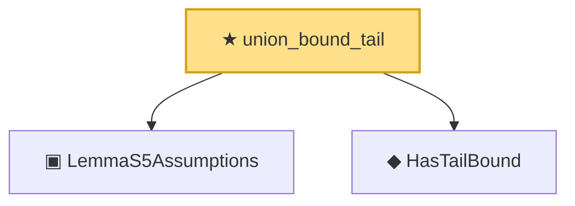

# Proof narrative — union_bound_tail

Root: **union_bound_tail** (theorem) `Statlib/CoxChangePoint/UniformProcessOpRate.lean:199` · topic `CoxChangePoint`
Closure: 3 declarations across 1 files. Generated from `proof_graph.json` — no files were moved.

Reading order (foundations first, headline last):

  ▣ `LemmaS5Assumptions` — structure · `Statlib/CoxChangePoint/UniformProcessOpRate.lean:22`  _(also used by 3: tail_bound_implies_OP_rate, lemma_s5_r0, lemma_s5)_
  ◆ `HasTailBound` — def · `Statlib/CoxChangePoint/UniformProcessOpRate.lean:45`  _(also used by 3: tail_bound_implies_OP_rate, lemma_s5_r0, lemma_s5)_
★ `union_bound_tail` — theorem · `Statlib/CoxChangePoint/UniformProcessOpRate.lean:199` **← headline**

## Dependency diagram

