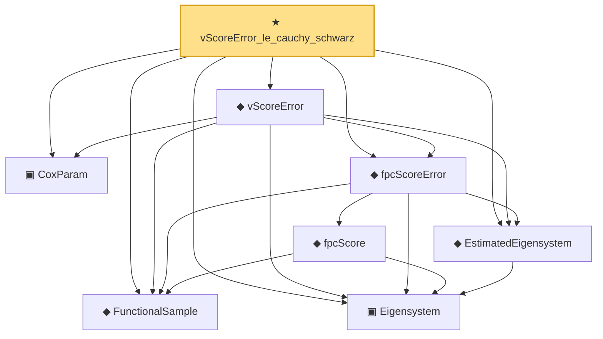

# Proof narrative — vScoreError_le_cauchy_schwarz

Root: **vScoreError_le_cauchy_schwarz** (theorem) `Statlib/CoxChangePoint/LemmaS2Supp.lean:40` · topic `CoxChangePoint`
Closure: 8 declarations across 3 files. Generated from `proof_graph.json` — no files were moved.

Reading order (foundations first, headline last):

  ◆ `FunctionalSample` — def · `Statlib/CoxChangePoint/FPC.lean:55`  _(also used by 11: CoxModel, truncatedScores, truncationResidual, …)_
  ▣ `Eigensystem` — structure · `Statlib/CoxChangePoint/FPC.lean:42`  _(also used by 18: benchmark_eigsys, CoxModel, truncatedScores, …)_
  ◆ `EstimatedEigensystem` — def · `Statlib/CoxChangePoint/FPC.lean:98`  _(also used by 5: SinThetaBound, SinThetaToPerturbHyp, SinThetaBound.toPerturbationBound, …)_
  ▣ `CoxParam` — structure · `Statlib/CoxChangePoint/Foundation.lean:57`  _(also used by 71: liftAuto, concreteGn, buildLemmaS1Data, …)_
    ◆ `fpcScore` — noncomputable def · `Statlib/CoxChangePoint/FPC.lean:64`  _(also used by 2: truncatedScores, truncationResidual)_
  ◆ `fpcScoreError` — noncomputable def · `Statlib/CoxChangePoint/FPC.lean:127`
  ◆ `vScoreError` — noncomputable def · `Statlib/CoxChangePoint/FPC.lean:140`
★ `vScoreError_le_cauchy_schwarz` — theorem · `Statlib/CoxChangePoint/LemmaS2Supp.lean:40` **← headline**

## Dependency diagram

